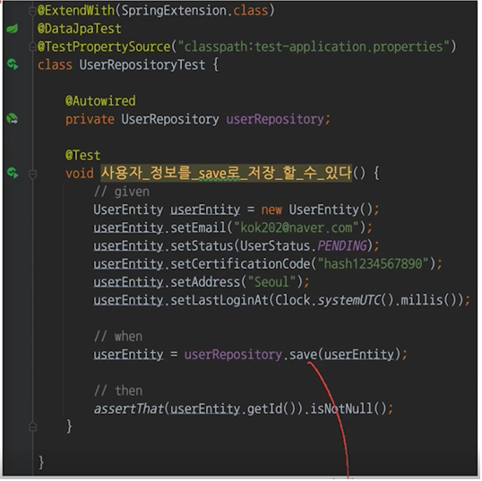

# 테스트에 대한 개요와 개발자가 해야할 고민
## 테스트란?
- 인수 테스트 : 사람이 직접 사용해보면서 준비된 체크리스트를 체크
- 자동 테스트 : 미리 짜여진 코드를 돌려서 결과값과 예상값을 비교.

DB를 사용하는 경우에는 H2를 활용해 RDB를 InMemory에 잠깐 띄워서 테스트를 함. 
@ExtendWith(SpringExtension.class)를 사용해서 테스트용으로 스프링을 띄움

## TDD
1) RED -> 깨지는 테스트를 먼저 작성한다. -> 일부러 실패하는 테스트를 만듦. (테스트를 돌려서 실패하는 것까지 확인하기.)
   - Q) 왜 깨지는 테스트를 먼저 작성함?

2) GREEN -> 깨지는 테스트를 성공시킨다.

3) BLUE -> 리팩토링한다. -> 복잡한 코드에서는 파괴적일 수 있음. 하지만, 이전 단계에서 그린을 확인했으니 상관 없음.

TDD는 이 과정을 무한 반복하는 것임.

## TDD의 장단점
### 장점
1) 깨지는 테스트를 먼저 작성해야함.
   - 이 때문에 인터페이스를 먼저 만드는 것이 강제됨.
     - 객체의 책임을 먼저 생각하게 만들어 줌.
     - 객체 지향의 핵심 원리 중 하나인 행동에 집중하겠다는 말과 같음.
     - What/Who 사이클을 고민하게 도와줌. ('어떤 행위'를 수행할지 결정 후 '누가' 그 행위를 수행할 것인지 결정)
2) 장기적인 관점에서 개발 비용이 감소

### 단점
1) 초기 개발 비용
   - 초기 개발 비용이 높아 서비스 초기 도입하기 껄끄러울 수 잇음.

2) 난이도
   - TDD 자체가 난이도가 높음.
   - 구성원의 실력이 어느정도 있어야 함.

## 개발자의 고민
 - 고민 1. 무의미한 테스트 (Recap)
   - JPA를 사용한 2-3줄의 간단한 코드에서도 테스트를 위해 60줄 가량의 코드가 필요함.
   - 하지만, JPA가 잘 처리했을 경우에 대한 테스트 코드도 작성해야함.
   - 또한, Spring Boot와 H2를 사용해서 굉장히 무거운 테스트일 수 있음.
 - 고민 2. 느리고 쉽게 깨지는 테스트
 - 고민 3. 테스트가 불가한 코드
   - 마지막 로그인 시간과 같은 경우 해당하는 시간을 테스트 코드에서 알 방법이 없음.
   - 이 경우엔 테스트가 신호를 보내는 것과 같음.
     - 테스트가 불가하므로, 설계가 잘못되었다.