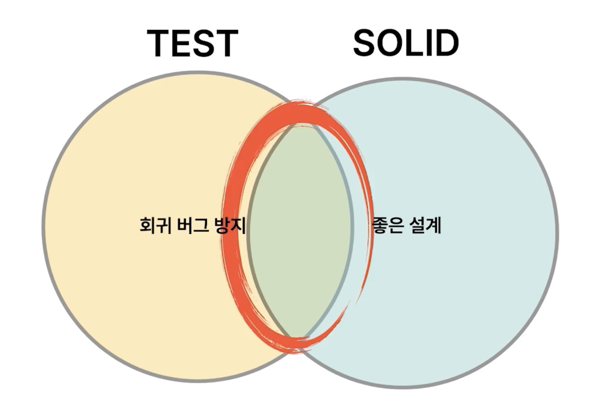
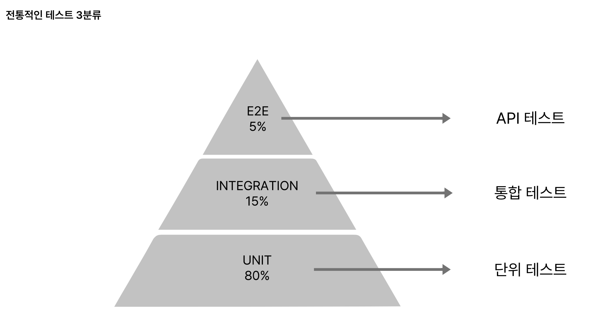

# 테스트의 필요성과 테스트 3분류

## 필요성
 - 테스트 코드는 왜 필요한가?
   - 레거시 코드 : 테스트 루틴이 없는 코드. 다만, 이 정의는 다소 불완전하다.
   - Regression : 정상 동작하던 코드가 이번 배포로 동작하지 않음.
     - 수정이 무서워지게 됨.
   - 좋은 아키텍처를 유도

### 좋은 아키텍처란? SOLID

 - SOLID와 Test는 서로 상호 보완적인 관계를 갖는다.
 - 테스트의 목적은 회귀버그 방지와 좋은 설계
   - SOLID가 지켜지면 좋은 설계가 되고, 이로 인해 회귀 버그가 생기는 것을 막을 수 있다.
 - 단일 책임 원칙
   - 클래스 하나에 테스트 클래스 하나가 생김.
     - 테스트 작성 시 테스트가 많아져 무슨 목적의 클래스인지 눈에 안 들어옴
     - 이때가 클래스를 분할해야하는 시점
       - 자연스럽게 책임이 분배됨.
 - 개방 폐쇄 원칙
   - 테스트와 프로덕션 컴포넌트를 나눠 작업하게 되고 필요에 따라 컴포넌트를 자유자재로 탈부착 가능하게 개발하게 됨.
 - 리스코프 치환 원칙
   - 테스트는 모든 케이스에 대해 커버하고 있어서 서브 클래스에 대한 치환 여부를 테스트가 알아서 판단해 줌.
 - 인터페이스 분리 원칙
   - 테스트는 그 자체로 인터페이스를 직접 사용해 볼 수 있는 환경임.
   - 불필요한 의존성을 실제로 확인할 수 있는 샌드박스.
 - 의존성 역전 원칙
   - 가짜 객체를 이용해 테스트 작성 시 의존성이 역전되어 있어야 하는 경우가 있음.
 - 테스트를 작성함에 따라 SOLID는 자연스럽게 따라옴.

### 케이스
 - CASE 1. 회귀 버그도 잡고 좋은 설계는 약간 신경 쓴 경우
 - CASE 2. 회귀 버그만 신경 쓴 경우
   - 테스트를 넣으려고 했을 때 이유가 무엇인지 잘 생각하기.
     - 회귀 버그 방지
     - 좋은 설계

## 테스트의 3분류
### 전통적인 테스트 3분류

 - 단위 테스트 = small 테스트
   - 단일 서버, 프로세스, 스레드
   - 디스크 I/O 사용 금지
   - Blocking call 허용 안 됨
   - 이러한 조건들 때문에 항상 결과가 '결정적'이고, 속도가 빠름.
 - 통합 테스트 = medium 테스트
   - 단일 서버
   - 멀티 프로세스, 스레드
   - H2같은 테스트 DB 사용 가능
   - 소형 테스트보다 느리고, 멀티 스레드에서 어떻게 동작할지 모름.
     - 결과가 결정적이라는 것을 보장하지 못함.
 - API 테스트 = large 테스트
   - 멀티 서버
   - End to end 테스트
 - 우리는 가장 많은 portion을 차지하는 소형 테스트에 집중해야 함.
 - 소형 테스트를 늘릴 수 있는 환경을 만들고 이를 늘려나가야 함.

## 정리
 - 테스트의 필요성에 대해 살펴봄.
 - 테스트와 좋은 아키텍처의 상관관계를 살펴봄.
 - 테스트 3분류에 대해 살펴봄.