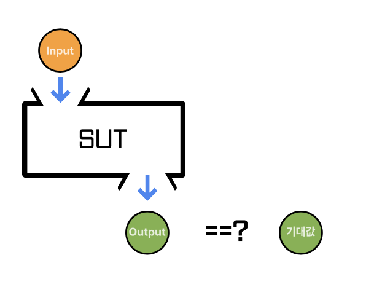
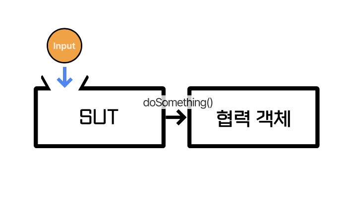

# 테스트에 필요한 개념

## 개념
### SUT
 - System under test : 테스트 하려는 대상

### BDD
 - Behaviour driven development (given - when - then)
 - TDD에서 추가로 하는 내용
 - 어디에 어떻게 넣을지 고민할 때 도움이 됨.
 - 3A (Arrange - Act - Assert) 와 동일시봐도 됨.

### Interaction Test (상호작용 테스트)
 - 대상 함수의 구현을 호출하지 않으면서 그 함수가 어떻게 후출되는지를 검증하는 기법
 - 일반적으로 메서드가 실제로 호출되었는지 검증하는 것은 좋은 방법이 아님.
   - 캡슐화에 위배됨.

### 상태 검증 vs 행위 검증

 - 상태 검증(state-based-verification)
   - 어떤 값을 시스템에 넣었을 때 결과값과 기댓값을 비교

 - 행위 기반 검증(behaviour-based-verification)
   - 상호 작용 테스트
   - 어떤 값을 시스템에 넣었을 때 어떤 메서드를 실행하는 가?

### 테스트 픽스처
 - 테스트에 필요한 자원을 생성하는 것

### 비욘세 규칙
 - 유지하고 싶은 상태나 정책이 있다면 알아서 테스트를 만들어야 한다.
 - 테스트를 작성하면 이것이 곧 정책이 된다.

### Testability
 - 테스트 가능성, SW가 테스트 가능한 구조인가?

### test double
 - 테스트 대역
 - 회원가입 시 이메일 발송이 필요한 경우
   - 이메일을 실제로 보내는 것이 아닌 가짜 객체를 씀.

## 대역

### Dummy
 - 아무 동작 없이, 코드가 정상적으로 돌아가기 위해 전달하는 객체

### Fake
 - Local에서 사용하거나 테스트에서 사용하기 위해 만들어진 가짜 객체, 자체적인 로직이 있음.

### Stub
 - 미리 준비된 값을 출력하는 객체

### Mock
 - 메서드 호출을 확인하기 위한 객체, 자가 검증 능력을 갖춤.
 - Test Double과 동일한 의미로 사용됨.

### Spy
 - 메서드 호출을 전부 기록했다가 나중에 확인하기 위한 객체
