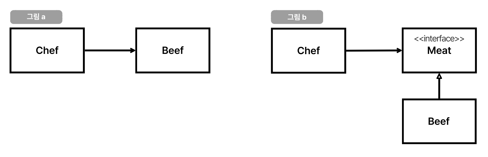

# 의존성과 Testability

## 의존성
- Dependency = coupling
- A는 B를 사용하기만 해도 의존한다고 할 수 있음.

### 의존성 주입
- Dependecy Injection : 의존성을 약화시키는 테크닉
- 직접 new해서 인스턴스화하는 것이 아니라 외부에서 넣어주는 것.
- 의존성은 완전 제거할 수 없음. (객체나 시스템 간의 협력을 부정하는 것임.)
- 대부분의 디자인 패턴과 설계는 의존성을 낮추기 위해 고민한 결과물인 경우가 많음.

### 의존성 역전
- Dependecy Injection(DI) != Dependency Inversion(SOLID-DIP)
- 의존성 역전은 **화살표의 방향을 바꾸는 테크닉**
- 모듈 간의 상하 관계 같은 것도 포함하는 개념
  
- 상위 모듈은 하위 모듈에 의존해서는 안됨.
    - 상위 모듈과 하위 모듈 모두 추상화에 의존해야 함.
- 추상화는 세부 사항에 의존해서는 안됨.
    - 세부사항이 추상화에 의존해야함.
- 로버트 마틴
  - 고수준 정책(Meat - interface)을 구현하는 코드는 저수준 세부사항(Beef - 구현체)을  구현하는 코드에 절대 의존해서는 안되고, 세부사항이 정책에 의존해야 한다.
  - 자바와 같은 정적 타입 언어에서  이 말은 use, import, include 구문은 오직 인터페이스나 추상 클래스 같은 추상적인 선언(정책, Meat - interface)만 참조해야함.
  - 우리가 의존을 피하고자 하는 것은 변동성이 큰 구체적인 요소(세부사항, Beef - 구현체)다.

## 의존성과 테스트

### 의존성이 나온 이유?
 - 테스트를 잘 하려면 의존성 주입과 의존성 역전을 잘 다뤄야 함.
 - 숨겨진 의존성은 테스트를 힘들게 만듦.
 - 의존성은 드러내는 것이 좋다.
 - 이전에 봤던 마지막 로그인 시간을 다루는 기능을 테스트할 경우
   - a. 시간을 의존성 주입으로 해결
     - 결국 해당 클래스를 사용하는 다른 클래스에선 의존성이 숨겨져 있다.
     - 어딘가에서는 값을 고정해서 직접 입력해줘야 함.
     - 폭탄 돌리기와 같다.
   - b. 의존성 주입 + 의존성 역전으로 해결
     - Clock을 주입하는 ClockHolder를 만들어 해결
     - 테스트 시 지정해 둔 시간만 내려주는 결과가 만들어짐.
     - 일관된 결과로 인해 테스트가 쉬워짐.
     - 배포 환경과 테스트 환경이 분리가 되었음.
 - Port-Adapter 패턴이라고도 부름.

## Testability
### 테스트 가능성
 - 얼마나 쉽게 input을 변겨앟고, output을 쉽게 검증할 수 있는가?