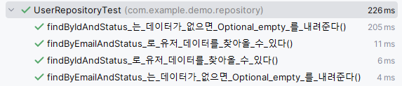
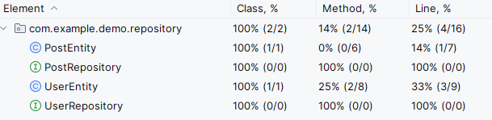

1. Gmail 설정
 - POP Download와 IMAP access를 허용해줘야함.
 - 앱 비밀번호를 설정함.

1-2. intellij 환경 변수에서 'MAIL_USERNAME={구글 아이디(주소 제외)};MAIL_APPLICATION_PASSWORD={발급받은 앱 비밀번호}'를 설정해줘야함.

2. UserRepository 테스트 생성
3. 테스트를 위해 @DataJpaTest(showSql = true) 를 붙여줌.
```java
@DataJpaTest(showSql = true)
public class UserRepositoryTest {

	@Autowired
	private UserRepository userRepository;
}
```

4. test 설정을 위해 test-application.properties를 생성
   3-1. 작성(복붙)
```properties
spring.datasource.url=jdbc:h2:mem:testdb;MODE=MySQL;DB_CLOSE_DELAY=-1
spring.datasource.driverClassName=org.h2.Driver
spring.datasource.username=sa
spring.datasource.password=
spring.h2.console.enabled=true

spring.jpa.hibernate.dialect=org.hibernate.dialect.MariaDBDialect
spring.jpa.database-platform=org.hibernate.dialect.H2Dialect
spring.jpa.hibernate.ddl-auto=create-drop
```

5. UserRepository가 Jpa가 H2랑 제대로 연결되었는지 확인을 위한 테스트 생성
   4-1. User Entity를 적당히 생성.
   4-2. User Entity save 호출
   4-3. assertThat을 통해 not Null 이면 성공
```java
@Test
void UserRepository_가_제대로_연결되었다(){
    // given
    UserEntity userEntity = new UserEntity();
    userEntity.setEmail("study7823@gmail.com");
    userEntity.setAddress("Seoul");
    userEntity.setNickname("study7823");
    userEntity.setStatus(UserStatus.ACTIVE);
    userEntity.setCertificationCode("aaaaaaaa-aaaa-aaaa-aaaa-aaaaaaaaaaaa");

    // when
    UserEntity result = userRepository.save(userEntity);

    // then
    assertThat(result.getId()).isNotNull();
}
```

6. 우리가 궁금한 것은 findByIdAndStatus 메서드와 findByEmailAndStatus 메서드가 제대로 동작하는지 여부임.
A) findByIdAndStatus 정상 조회
A-1. User Entity를 적당히 생성해 데이터를 저장
A-2. 결과값이 존재 여부를 확인
```java
@Test
void findByIdAndStatus_로_유저_데이터를_찾아올_수_있다(){
    // given
    UserEntity userEntity = new UserEntity();
    userEntity.setId(1L);
    userEntity.setEmail("study7823@gmail.com");
    userEntity.setAddress("Seoul");
    userEntity.setNickname("study7823");
    userEntity.setStatus(UserStatus.ACTIVE);
    userEntity.setCertificationCode("aaaaaaaa-aaaa-aaaa-aaaa-aaaaaaaaaaaa");

    // when
    userRepository.save(userEntity);
    Optional<UserEntity> result = userRepository.findByIdAndStatus(1, UserStatus.ACTIVE);

    // then
    assertThat(result.isPresent()).isTrue();

}
```

B) findByIdAndStatus 데이터가 없을 경우
B-1. User Entity를 적당히 생성하되, 유저 상태를 PENDING으로 설정 후 데이터를 저장
B-2. 결과값이 isEmpty()인지 확인
```java
@Test
void findByIdAndStatus_는_데이터가_없으면_Optional_empty_를_내려준다(){
    // given
    UserEntity userEntity = new UserEntity();
    userEntity.setId(1L);
    userEntity.setEmail("study7823@gmail.com");
    userEntity.setAddress("Seoul");
    userEntity.setNickname("study7823");
    userEntity.setStatus(UserStatus.ACTIVE);
    userEntity.setCertificationCode("aaaaaaaa-aaaa-aaaa-aaaa-aaaaaaaaaaaa");

    // when
    userRepository.save(userEntity);
    Optional<UserEntity> result = userRepository.findByIdAndStatus(1, UserStatus.PENDING);

    // then
    assertThat(result.isEmpty()).isTrue();
    assertThat(result.isPresent()).isFalse(); // 위와 동일

}
```

C) findByEmailAndStatus 정상 조회
C-1. User Entity를 적당히 생성해 데이터를 저장
C-2. 결과값이 존재 여부를 확인
```java
@Test
void findByEmailAndStatus_로_유저_데이터를_찾아올_수_있다(){
    // given
    UserEntity userEntity = new UserEntity();
    userEntity.setId(1L);
    userEntity.setEmail("study7823@gmail.com");
    userEntity.setAddress("Seoul");
    userEntity.setNickname("study7823");
    userEntity.setStatus(UserStatus.ACTIVE);
    userEntity.setCertificationCode("aaaaaaaa-aaaa-aaaa-aaaa-aaaaaaaaaaaa");

    // when
    userRepository.save(userEntity);
    Optional<UserEntity> result = userRepository.findByEmailAndStatus("study7823@gmail.com", UserStatus.ACTIVE);

    // then
    assertThat(result.isPresent()).isTrue();

}
```

D) findByEmailAndStatus 데이터가 없을 경우
D-1. User Entity를 적당히 생성하되, 유저 상태를 PENDING으로 설정 후 데이터를 저장
D-2. 결과값이 isEmpty()인지 확인
```java
@Test
void findByEmailAndStatus_는_데이터가_없으면_Optional_empty_를_내려준다(){
    // given
    UserEntity userEntity = new UserEntity();
    userEntity.setId(1L);
    userEntity.setEmail("study7823@gmail.com");
    userEntity.setAddress("Seoul");
    userEntity.setNickname("study7823");
    userEntity.setStatus(UserStatus.ACTIVE);
    userEntity.setCertificationCode("aaaaaaaa-aaaa-aaaa-aaaa-aaaaaaaaaaaa");

    // when
    userRepository.save(userEntity);
    Optional<UserEntity> result = userRepository.findByEmailAndStatus("study7823@gmail.com", UserStatus.PENDING);

    // then
    assertThat(result.isEmpty()).isTrue();
    assertThat(result.isPresent()).isFalse(); // 위와 동일

}
```

7. 단독으로는 실행이 됨. 하지만, 전체 테스트를 돌릴 경우 실패함.
   -> 병렬로 처리될 때 동시성 제어가 안됨.


8. Test 코드 내에서 User Entity 값이 중복되어 생성되고 삽입되는 문제를 해결하기 위해 테스트할 때 준비된 값을 사용하도록 함.
   -> @Sql(URL)
 - 중복되는 삽입 코드를 제거
```java
// given
UserEntity userEntity = new UserEntity();
userEntity.setId(1L);
userEntity.setEmail("study7823@gmail.com");
userEntity.setAddress("Seoul");
userEntity.setNickname("study7823");
userEntity.setStatus(UserStatus.ACTIVE);
userEntity.setCertificationCode("aaaaaaaa-aaaa-aaaa-aaaa-aaaaaaaaaaaa");

// when
userRepository.save(userEntity);
```
9. resources 폴더 내에 sql 파일을 생성해준 후 어노테이션에 SQL 파일을 지정해줌.
   
```properties
insert into `users` (`id`, `email`, `nickname`, `address`, `certification_code`, `status`, `last_login_at`)
values (1, 'kok202@naver.com', 'kok202', 'Seoul', 'aaaaaaaa-aaaa-aaaa-aaaa-aaaaaaaaaaaa', 'ACTIVE', 0);
```

 - 이제 필요없어진 JPA와 H2 테스트를 제거

10. 이제 전체 동작 시키면 정상 동작함.


11. post Repository는 테스트할 메서드가 없으므로 패스.
 - 이전 강의에서 얘기했던, 잘 동작하도록 만들어진 JPA를 테스트할 필요는 없다는 것 참고.


11. 커버리지 측정
