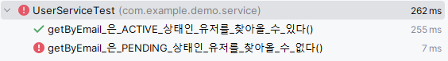
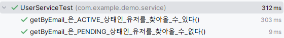
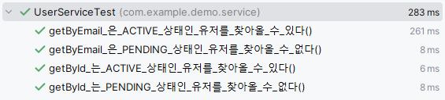
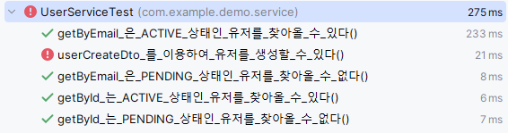
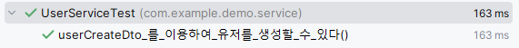
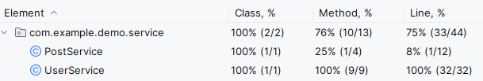

## Service 리팩토링
### get과 find를 구분하는 컨벤션!
 - find는 null을 반환할 수 있어 Optional로 받는 경우가 많음.
 - get은 데이터가 없으면 에러를 던진다는 의미가 내포됨.
 - 해당 컨벤션에 따라 네이밍 변경!
```java
public Optional<UserEntity> getById(long id){}
 -> public Optional<UserEntity> findById(long id)

public UserEntity getByIdOrElseThrow(long id) {}
 -> public UserEntity getById(long id) {}
```

### User 서비스 자체에서 create가 유저를 생성한다는 의미를 내포함.
```java
public UserEntity createUser(UserCreateDto userCreateDto) {}
 -> public UserEntity create(UserCreateDto userCreateDto) {}

public UserEntity updateUser(long id, UserUpdateDto userUpdateDto) {}
 -> public UserEntity update(long id, UserUpdateDto userUpdateDto) {
```

### 위와 같은 논리로 Post Service 내의 메서드도 리네이밍을 함.
```java
public PostEntity getPostById(long id) {}
 -> public PostEntity getById(long id) {

public PostEntity createPost(PostCreateDto postCreateDto) {}
 -> public PostEntity create(PostCreateDto postCreateDto) {}

public PostEntity updatePost(long id, PostUpdateDto postUpdateDto) {}
 -> public PostEntity update(long id, PostUpdateDto postUpdateDto) {}
```

## User Service 테스트작성
### 1. 테스트를 생성 후(@SpringBootTest 사용) @SQL 적용
```java
@SpringBootTest
@Sql("/sql/user-service-test-data.sql")
public class UserServiceTest {

	@Autowired
	private UserService userService;
}
```
```sql
insert into `users` (`id`, `email`, `nickname`, `address`, `certification_code`, `status`, `last_login_at`)
values (1, 'kok202@naver.com', 'kok202', 'Seoul', 'aaaaaaaa-aaaa-aaaa-aaaa-aaaaaaaaaaaa', 'ACTIVE', 0);
insert into `users` (`id`, `email`, `nickname`, `address`, `certification_code`, `status`, `last_login_at`)
values (2, 'kok303@naver.com', 'kok303', 'Seoul', 'aaaaaaaa-aaaa-aaaa-aaaa-aaaaaaaaaaab', 'PENDING', 0);
```

### 2. 메서드 테스트 작성
**2-1. getByEmail 메서드가 ACTIVE 유저만 가져오는지 여부 테스트**
```java
@Test
void getByEmail_은_ACTIVE_상태인_유저를_찾아올_수_있다(){
    // given
    String email = "kok202@naver.com";

    // when
    UserEntity result = userService.getByEmail(email);

    // then
    assertThat(result.getNickname()).isEqualTo("kok202");
}

@Test
	void getByEmail_은_PENDING_상태인_유저를_찾아올_수_없다(){
		// given
		String email = "kok303@naver.com";

		// when
		// then
		assertThatThrownBy(() -> {
		UserEntity result = userService.getByEmail(email);
		}).isInstanceOf(ResourceNotFoundException.class);
	}
```
각각 돌렸을 경우엔 정상 동작하지만, 동시에 돌릴 경우 2번째 삽입에서 문제가 발생함!


 - 첫 SQL문 동작에선 정상 동작하는데, 2번째 동작에서 문제가 발생하는 것으로 생각됨.
   - @SqlGroup을 사용하여 해결!
```java
@SpringBootTest
@SqlGroup({
	@Sql(value = "/sql/user-service-test-data.sql", executionPhase = ExecutionPhase.BEFORE_TEST_METHOD),
	@Sql(value = "/sql/delete-all-data.sql", executionPhase = ExecutionPhase.AFTER_TEST_METHOD)
})
public class UserServiceTest {}
```
```sql
delete from `users` where 1;
delete from `posts` where 1; --이왕하는 거 게시물 지우기도 미리 작성!
```



**2-2.getByEmail 메서드가 ACTIVE 유저만 가져오는지 여부 테스트**

```java
@Test
 void getById_는_ACTIVE_상태인_유저를_찾아올_수_있다(){
     // given
     // when
     UserEntity result = userService.getById(1);

     // then
     assertThat(result.getNickname()).isEqualTo("kok202");
 }

 @Test
 void getById_는_PENDING_상태인_유저를_찾아올_수_없다(){
     // given
     // when
     // then
     assertThatThrownBy(() -> {
         UserEntity result = userService.getById(2);
     }).isInstanceOf(ResourceNotFoundException.class);
 }
```


**2-3. User Create/Update 메서드 정상 동작 테스트**
```java
@Test
 void userCreateDto_를_이용하여_유저를_생성할_수_있다(){
     // given
     UserCreateDto userCreateDto = UserCreateDto.builder()
         .email("kok202@kakao.com")
         .address("Gyeongi")
         .nickname("kok202-k")
         .build();

     // when
     UserEntity result = userService.create(userCreateDto);

     // then
     assertThat(result.getId()).isNotNull();
     assertThat(result.getStatus()).isEqualTo(UserStatus.PENDING);
     // assertThat(result.getCertificationCode()).isEqualTo("T.T");
 }
```
 - certificationCode의 경우 UUID random 값이라 확인이 안됨. 이후 다시 처리 예정!



이메일 발송에 실패함.

 - Mockito를 활용해 메일 발송을 처리.
 - JavaMailSender를 MockBean으로 등록.
```java
@SpringBootTest
@TestPropertySource("classpath:test-application.properties")
@SqlGroup({
	@Sql(value = "/sql/user-service-test-data.sql", executionPhase = ExecutionPhase.BEFORE_TEST_METHOD),
	@Sql(value = "/sql/delete-all-data.sql", executionPhase = ExecutionPhase.AFTER_TEST_METHOD)
})
public class UserServiceTest {

	@Autowired
	private UserService userService;

	@MockBean
	private JavaMailSender javaMailSender;
	
	@Test
	void userCreateDto_를_이용하여_유저를_생성할_수_있다(){
		// given
		UserCreateDto userCreateDto = UserCreateDto.builder()
			.email("kok202@kakao.com")
			.address("Gyeongi")
			.nickname("kok202-k")
			.build();

		BDDMockito.doNothing().when(javaMailSender).send(any(SimpleMailMessage.class));

		// when
		UserEntity result = userService.create(userCreateDto);

		// then
		assertThat(result.getId()).isNotNull();
		assertThat(result.getStatus()).isEqualTo(UserStatus.PENDING);
		// assertThat(result.getCertificationCode()).isEqualTo("T.T");
	}

}
```
 - 모킹 후 성공!


 - user update
```java
@Test
void userUpdateDto_를_이용하여_유저를_수정할_수_있다(){
  // given
  UserUpdateDto userUpdateDto = UserUpdateDto.builder()
      .address("Incheon")
      .nickname("kok202-n")
      .build();

  // when
  userService.update(1, userUpdateDto);

  // then
  UserEntity userEntity = userService.getById(1);
  assertThat(userEntity.getId()).isNotNull();
  assertThat(userEntity.getAddress()).isEqualTo("Incheon");
  assertThat(userEntity.getNickname()).isEqualTo("kok202-n");
}
```

**2-4.유저 로그인 시 마지막 로그인 시간 테스트**
```java
@Test
void user_를_로그인_시키면_마지막_로그인_시간이_변경된다(){
   // given
   // when
   userService.login(1);
   
   // then
   UserEntity userEntity = userService.getById(1);
   assertThat(userEntity.getLastLoginAt()).isGreaterThan(0L);
   // assertThat(result.getLastLoginAt()).isEqualTo("xx"); // Fix!
}
```
 - 로그인 시간은 추후 구현해서 테스트 예정!

**2-5. verifyEmail 테스트** 


커버리지 측정

 - 아직 post Service는 작성 되지 않아서 커버리지가 낮음.

**2-6. Post Service에 존재하는 메서드 테스트도 작성**
```java
@Test
void getById_는_게시물을_가져온다(){
  // given
  // when
  PostEntity result = postService.getById(1);

  // then
  assertThat(result.getContent()).isEqualTo("helloworld");
  assertThat(result.getWriter().getEmail()).isEqualTo("kok202@naver.com");
}

@Test
void postCreateDto_를_이용하여_게시물을_생성할_수_있다(){
  // given
  PostCreateDto postCreateDto = PostCreateDto.builder()
          .writerId(1)
          .content("foobar")
          .build();

  // when
  PostEntity result = postService.create(postCreateDto);

  // then
  assertThat(result.getId()).isNotNull();
  assertThat(result.getContent()).isEqualTo("foobar");
  assertThat(result.getCreatedAt()).isGreaterThan(0);
}

@Test
void postUpdateDto_를_이용하여_게시물을_수정할_수_있다(){
  // given
  PostUpdateDto postUpdateDto = PostUpdateDto.builder()
      .content("hello world :)")
      .build();

  // when
  postService.update(1, postUpdateDto);

  // then
  PostEntity postEntity = postService.getById(1);
  assertThat(postEntity.getContent()).isEqualTo("hello world :)");
  assertThat(postEntity.getModifiedAt()).isGreaterThan(0);
}
```

## 최종 Service 커버리지 측정!


컨트롤러는 다음 포스팅에서 완료 예정입니다...!