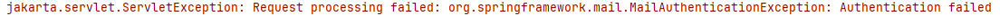
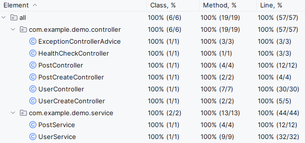

# Controller 테스트
1. test 패키지와 파일 생성.
2. 만만한 HealthCheck부터 시작!
3. API 테스트에 많이 사용되는 mockMvc 사용.
```java
@SpringBootTest
@AutoConfigureMockMvc
@AutoConfigureTestDatabase
public class HealthCheckControllerTest {

	@Autowired
	private MockMvc mockMvc;
	
}
```
4. mockMvc를 통해 호출(GET 방식), 응답이 200인지 확인.
```java
@Test
void 헬스_체크_응답이_200으로_내려온다() throws Exception {
    mockMvc.perform(get("/health_check.html"))
        .andExpect(status().isOk());
}
```
5. 다른 컨트롤러들의 테스트도 생성해준다.

6. json 응답에서 특정 경로의 데이터 확인 방법
```java
@Test
void 사용자는_특정_유저의_정보를_전달_받을_수_있다() throws Exception {
    // given
    // when
    // then
    mockMvc.perform(get("/api/users/1"))
        .andExpect(status().isOk())
        .andExpect(jsonPath("$.id").value(1));
}
```
7. UserController 테스트를 위해 SQL 추가
```sql
insert into `users` (`id`, `email`, `nickname`, `address`, `certification_code`, `status`, `last_login_at`)
values (1, 'kok202@naver.com', 'kok202', 'Seoul', 'aaaaaaaa-aaaa-aaaa-aaaa-aaaaaaaaaaaa', 'ACTIVE', 0);
insert into `users` (`id`, `email`, `nickname`, `address`, `certification_code`, `status`, `last_login_at`)
values (2, 'kok303@naver.com', 'kok303', 'Seoul', 'aaaaaaaa-aaaa-aaaa-aaaa-aaaaaaaaaaab', 'PENDING', 0);
```

8. UserController 테스트 작성
```java
private final ObjectMapper objectMapper = new ObjectMapper();

@Test
void 사용자는_특정_유저의_정보를_개인정보는_소거된_채_전달_받을_수_있다() throws Exception {
    // given
    // when
    // then
    mockMvc.perform(get("/api/users/1"))
        .andExpect(status().isOk())
        .andExpect(jsonPath("$.id").value(1))
        .andExpect(jsonPath("$.email").value("kok202@naver.com"))
        .andExpect(jsonPath("$.nickname").value("kok202"))
        .andExpect(jsonPath("$.address").doesNotExist())
        .andExpect(jsonPath("$.status").value("ACTIVE"));
}

@Test
void 사용자는_존재하지_않는_유저의_아이디로_api_호출할_경우_404_응답을_받는다() throws Exception {
    // given
    // when
    // then
    mockMvc.perform(get("/api/users/123456789"))
        .andExpect(status().isNotFound())
        .andExpect(content().string("Users에서 ID 123456789를 찾을 수 없습니다."));
}

@Test
void 사용자는_인증_코드로_계정을_활성화_시킬_수_있다() throws Exception {
    // given
    // when
    // then
    mockMvc.perform(get("/api/users/2/verify")
            .queryParam("certificationCode", "aaaaaaaa-aaaa-aaaa-aaaa-aaaaaaaaaaab"))
        .andExpect(status().isFound());
    UserEntity userEntity = userRepository.findById(2L).get();
    assertThat(userEntity.getStatus()).isEqualTo(UserStatus.ACTIVE);
}

@Test
void 사용자는_내_정보를_불러올_때_개인정보인_주소도_갖고_올_수_있다() throws Exception {
    // given
    // when
    // then
    mockMvc.perform(get("/api/users/me")
            .header("EMAIL", "kok202@naver.com"))
        .andExpect(status().isOk())
        .andExpect(jsonPath("$.id").value(1))
        .andExpect(jsonPath("$.email").value("kok202@naver.com"))
        .andExpect(jsonPath("$.nickname").value("kok202"))
        .andExpect(jsonPath("$.address").value("Seoul"))
        .andExpect(jsonPath("$.status").value("ACTIVE"));;
}

@Test
void 사용자는_내_정보를_수정할_수_있다() throws Exception {
    // given
    UserUpdateDto userUpdateDto = UserUpdateDto.builder()
            .nickname("kok202-n")
            .address("Pangyo").build();

    // when
    // then
    mockMvc.perform(put("/api/users/me")
            .header("EMAIL", "kok202@naver.com")
            .contentType(MediaType.APPLICATION_JSON)
            .content(objectMapper.writeValueAsString(userUpdateDto)))
        .andExpect(status().isOk())
        .andExpect(jsonPath("$.id").value(1))
        .andExpect(jsonPath("$.email").value("kok202@naver.com"))
        .andExpect(jsonPath("$.nickname").value("kok202-n"))
        .andExpect(jsonPath("$.address").value("Pangyo"))
        .andExpect(jsonPath("$.status").value("ACTIVE"));
}
```
 - 응답이 Json이 아닌 문자열이면 content를 사용해 비교할 수 있음
9. UserCreateController 테스트 작성
 - UserCreateController에는 필요한 데이터 세팅이 없어서 delete만 사용!
```java
@Test
void 사용자를_생성할_수_있다() throws Exception {
    // given
    UserCreateDto userCreateDto = UserCreateDto.builder()
    .email("kok202@naver.com")
    .nickname("kok202")
    .address("Pangyo").build();

    // when
    // then
    mockMvc.perform(post("/api/users")
    .header("EMAIL", "kok202@naver.com")
    .contentType(MediaType.APPLICATION_JSON)
    .content(objectMapper.writeValueAsString(userCreateDto)))
    .andExpect(status().isCreated())
    .andExpect(jsonPath("$.id").value(1))
    .andExpect(jsonPath("$.email").value("kok202@naver.com"))
    .andExpect(jsonPath("$.nickname").value("kok202"))
    .andExpect(jsonPath("$.address").value("Pangyo"))
    .andExpect(jsonPath("$.status").value("PENDING"));
}
```
 - 동작 시 메일 부분에서 에러가 발생함!

 - 모키토 추가하기!
```java
BDDMockito.doNothing().when(javaMailSender).send(any(SimpleMailMessage.class));
```
10. 나머지 Controller도 테스트 작성
 - PostControllerTest
```java
@Test
void 사용자는_게시물을_단건_조회_할_수_있다() throws Exception {
    // given
    // when
    // then
    mockMvc.perform(get("/api/posts/1"))
        .andExpect(status().isOk())
        .andExpect(jsonPath("$.id").isNumber())
        .andExpect(jsonPath("$.content").value("helloworld"))
        .andExpect(jsonPath("$.writer.id").isNumber())
        .andExpect(jsonPath("$.writer.email").value("kok202@naver.com"))
        .andExpect(jsonPath("$.writer.nickname").value("kok202"));
}

@Test
void 사용자가_존재하지_않는_게시물을_조회할_경우_에러가_난다() throws Exception {
    // given
    // when
    // then
    mockMvc.perform(get("/api/posts/123456789"))
        .andExpect(status().isNotFound())
        .andExpect(content().string("Posts에서 ID 123456789를 찾을 수 없습니다."));
}

@Test
void 사용자는_게시물을_수정할_수_있다() throws Exception {
    // given
    PostUpdateDto postUpdateDto = PostUpdateDto.builder()
        .content("foobar")
        .build();

    // when
    // then
    mockMvc.perform(
            put("/api/posts/1")
                .contentType(MediaType.APPLICATION_JSON)
                .content(objectMapper.writeValueAsString(postUpdateDto)))
        .andExpect(status().isOk())
        .andExpect(jsonPath("$.id").isNumber())
        .andExpect(jsonPath("$.content").value("foobar"))
        .andExpect(jsonPath("$.writer.id").isNumber())
        .andExpect(jsonPath("$.writer.email").value("kok202@naver.com"))
        .andExpect(jsonPath("$.writer.nickname").value("kok202"));
}
```
 - post-controller-test-data
```sql
insert into `users` (`id`, `email`, `nickname`, `address`, `certification_code`, `status`, `last_login_at`)
values (1, 'kok202@naver.com', 'kok202', 'Seoul', 'aaaaaaaa-aaaa-aaaa-aaaa-aaaaaaaaaaaa', 'ACTIVE', 0);
insert into `posts` (`id`, `content`, `created_at`, `modified_at`, `user_id`)
values (1, 'helloworld', 1678530673958, 0, 1);
```
 - PostCrateControllerTest
```java
@Test
void 사용자는_게시물을_작성할_수_있다() throws Exception {
    // given
    PostCreateDto postCreateDto = PostCreateDto.builder()
        .writerId(1)
        .content("helloworld")
        .build();

    // when
    // then
    mockMvc.perform(
            post("/api/posts")
                .contentType(MediaType.APPLICATION_JSON)
                .content(objectMapper.writeValueAsString(postCreateDto)))
        .andExpect(status().isCreated())
        .andExpect(jsonPath("$.id").isNumber())
        .andExpect(jsonPath("$.content").value("helloworld"))
        .andExpect(jsonPath("$.writer.id").isNumber())
        .andExpect(jsonPath("$.writer.email").value("kok202@naver.com"))
        .andExpect(jsonPath("$.writer.nickname").value("kok202"));
}
```
 - post-create-controller-test-data
```sql
insert into `users` (`id`, `email`, `nickname`, `address`, `certification_code`, `status`, `last_login_at`)
values (1, 'kok202@naver.com', 'kok202', 'Seoul', 'aaaaaaaa-aaaa-aaaa-aaaa-aaaaaaaaaaaa', 'ACTIVE', 0);
```
 - UserCreateControllerTest
```java
@Test
void 사용자는_회원_가입을_할_수_있고_회원가입된_사용자는_PENDING_상태이다() throws Exception {
    // given
    UserCreateDto userCreateDto = UserCreateDto.builder()
        .email("kok202@naver.com")
        .nickname("kok202")
        .address("Pangyo").build();
    BDDMockito.doNothing().when(javaMailSender).send(any(SimpleMailMessage.class));

    // when
    // then
    mockMvc.perform(post("/api/users")
            .header("EMAIL", "kok202@naver.com")
            .contentType(MediaType.APPLICATION_JSON)
            .content(objectMapper.writeValueAsString(userCreateDto)))
        .andExpect(status().isCreated())
        .andExpect(jsonPath("$.id").value(1))
        .andExpect(jsonPath("$.email").value("kok202@naver.com"))
        .andExpect(jsonPath("$.nickname").value("kok202"))
        .andExpect(jsonPath("$.status").value("PENDING"));
}
```
11. 테스트 커버리지 측정


12. 마무리
 - 레이어드 아키텍처 Test는 어느정도 완료됨.
 - 아래와 같은 문제를 다음 강의 때 해결할 예정임.
   - UUID, private 메서드, 사용자에게 가는 메시지, 마지막 로그이 시간 등 부족한 부분이 있음.
   - 지금 H2를 사용해서 속도가 느림.
   - 동시성 문제도 발생함.
