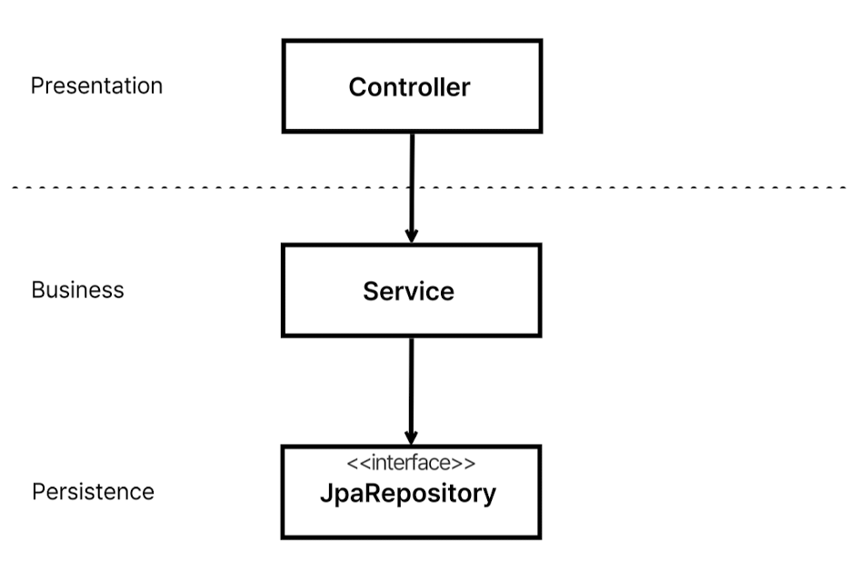
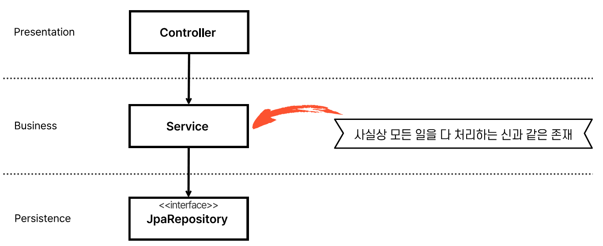
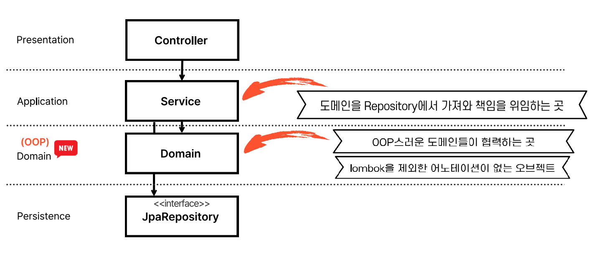
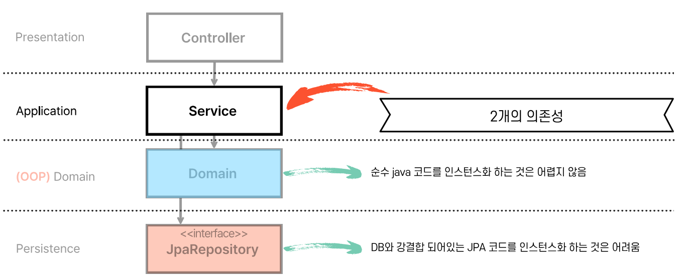
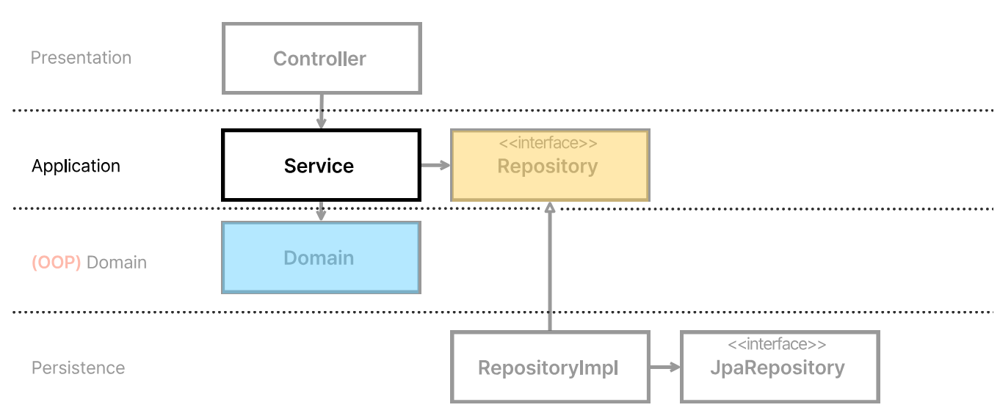
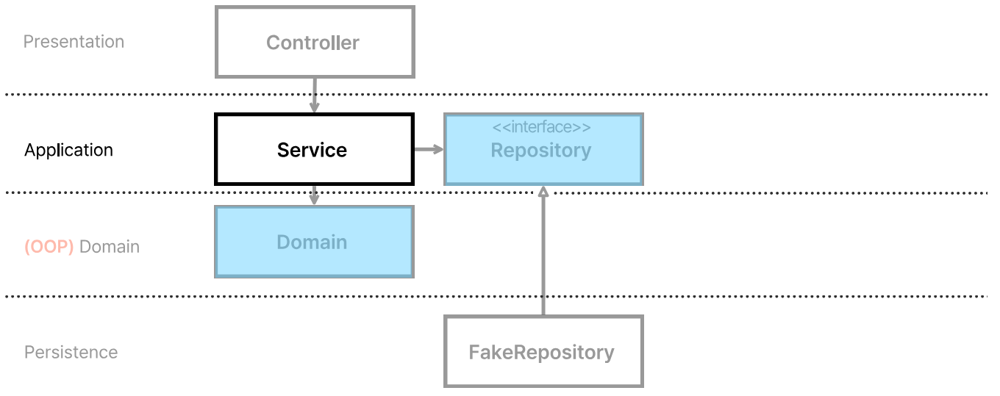
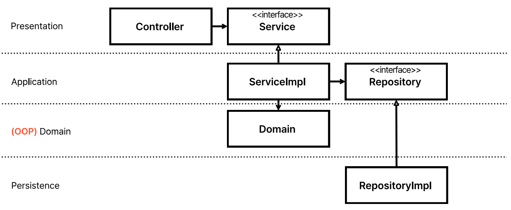

# H2
## 모든 테스트가 H2를 필요로 한다.
 - H2를 사용하는 순간 중형 테스트가 된다.
   - 모든 테스트가 중형 테스트가 되었음...
   - 소형 테스트가 없음
   - 무거움...!
 - 설계가 잘못되었을 확률
 - 지금 작성한 테스트가 실제로 테스트가 필요한 본질이 아닐 확률

# 레이어드 아키텍처의 문제점
## 레이어드 아키텍처

 - 유사한 기능들을 같은 계층으로 묶어 관리하는 방식의 아키텍처 구조
 - 의존성 역전이나 추상화 없이 바로 구현체를 사용하는 구조
 - 요청은 순차적이다
   - Controller가 받아서 Service에게 전달
   - Service는 비즈니스 로직을 처리 후 Persistence(JPA)에게 전달
   - JPA는 Repository 데이터를 가져와 Service에게 전달
   - 다시 Service는 비즈니스 로직을 처리 후 Controller에게 전달
   - Controller는 클라이언트에게 응답
 - 너무나 직관적이고 배우기 쉬움.
 - 가시적으로 보이기 때문에 결과물을 만들어 낼 때 아주 빠르고 정확하게 만들 수 있다.

## 레이어드 아키텍처의 단점
### 1. DB 위주의 설계를 하게 된다.
 - 계층형 아키텍처는 데이터베이스 주도 설계를 유도한다. 모든 계층이 영속성 계층을 토대로 만들어진다.
  - 톰 홈버그
 - 가장 아랫단인 영속성 레이어를 어떻게 만들지 고민하게 됨.
   - 나도 개발하며 고민하는 부분은
   1. DB 설계 시 어느 정도까지 비즈니스 로직이나 개발 관점(서버)에서 고려하며 설계해야 하는가?
      - 테이블 단위부터, 테이블 내의 데이터 설계 시 개발 관점이 많이 들어가는 고민이 있을 때가 있음.
   2. 기능 개발 시 어느 정도까지 DB의 설계를 고려해야 하는가?
      - DB에 따라 Entity가 달라지고, 이에 따라 비즈니스 로직이 변경되는 경우가 있음. 이로 인해서 간단한 기능조차 join이 4개, 5개 그 이상이 들어가면 설계가 잘 못 되었나 고민이 듦.
### 만약 주문 시스템을 만들어야 한다면 가장 먼저 할 것은?
 - JPA Entity나 테이블을 먼저 고민한 사람들이 많을 것임.
 - 하지만 실제론 주문 시스템에 필요한 Use Case를 파악하는 게 먼저임.
   - 주문하기, 주문 내역 확인, 주문 취소 등이 나와야함.
   - 이후 이를 처리하기 위한 도메인과 도메인 간의 관계를 먼저 생각해야 함.
### 2. 동시 작업
 - 이러한 기대를 충족시키려면 아키텍처가 동시 작업을 지원해야함.
 - 기능 개발 시 Service 객체, 영속성 객체와 Repository가 나와야 개발이 가능함.
   - 이로 인해서 특정 기능은 한 명이 개발 가능하게 됨.
   - 이는 레이어드 아키텍처 뿐 아니라 절차 지향의 문제점임.

### 3. 죽은 도메인 - 계층형 아키텍처는 업무 도메인에 대해 아무것도 말해주지 않는다.
 - 모든 코드가 함수 위주로 돌아간다.
 - 함수지향적인 개발을 하게 된다.
 - Service가 사실상 모든 일을 처리하게 된다.
   - Fat Service라고 부른다.

### 4. 동시 작업이 불가능하다.
### 5. 규모가 커질수록 확장성이 떨어진다.

### 위와 같은 단점들로 절차지향적 사고를 유도하게 된다.
 - 낮은 Testability
 - Bad SOLID

# 개선된 아키텍처
## 도메인
 - 비즈니스 문제를 해결하는 객체 모델

### 1. 도메인 레이어를 생성
 - Service가 하던 일을 도메인이 맡아서 하게 함.
 - Service가 Repository에서 도메인을 가져와서 도메인한테 일을 시키는 정도의 역할을 하게 함.
 - 실제 업무는 도메인 영역에서 하게 됨.
 - 도메인을 OOP 스러운 객체들이 협력하는 영역이 되게 함.
 - 도메인 모델은 롬복을 제외한 어노테이션이 달리지 않게 사용함.
   - 도메인 Entity와 영속성 객체를 구분

### 2. SOLID & 동시 작업
 - 차차 알게 될 것임.
### 3. 낮은 Testability
 - 도메인은 계층간 연결된 의존성 없음!
 - 나가는 화살표가 없음.
 - 이로 인해 Mocking을 할 필요가 없음!
 - 그 자체로 순수 Java 코드라서 인스턴스로 만들기 좋음.
 - 테스트하는 데 문제가 없음
 - JPA의 경우 이미 JPA에서 잘 만들어 놨기에 테스트할 필요가 없다고 생각됨.

 - 도메인은 순수 자바 코드라 인스턴스화가 쉬움.
 - JPA는 DB와 강결합되어 있어 인스턴스화가 어려움.
 - H2 같은 임베디드 DB 없이 어려움.
 - 따라서 우리는 비즈니스 레이어에 우리가 만든 Repository 인터페이스를 위치시킬 것임.

 - 이로 인해 테스트 시 Fake Repository를 사용해 엄청난 발전을 이뤄냄.
   - 이는 영속성 계층과의 의존 관계가 놀랍도록 낮아지게 함.
 - DB가 RDB에서 NoSQL 등으로 변경되어도 큰 문제가 없음

 - 컨트롤러는 Service, Repository, Domain 3가지 의존을 갖고 있음.
 - Service를 인터페이스로 만들고 사용하게 되면 FakeService를 사용해서 테스트 가능함.

# 개선된 아키텍처

 - 앞으로 모든 외부 연동을 의존 역전 시킴.
 - 앞으로 모든 외부 연동을 Infrastructure 레이어라고 칭함.