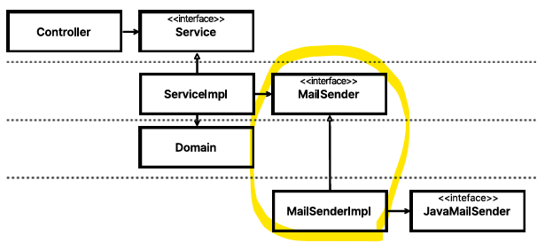
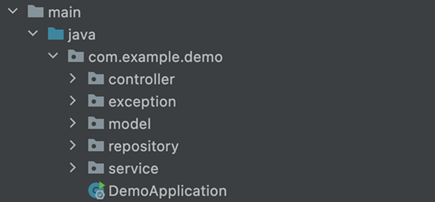
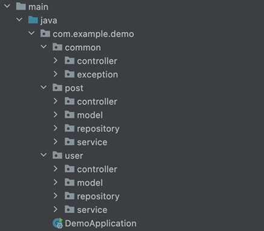
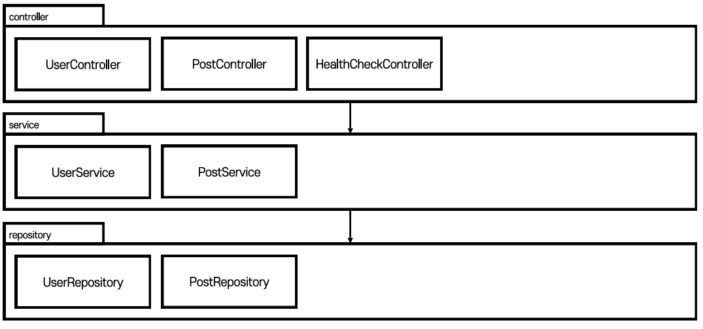
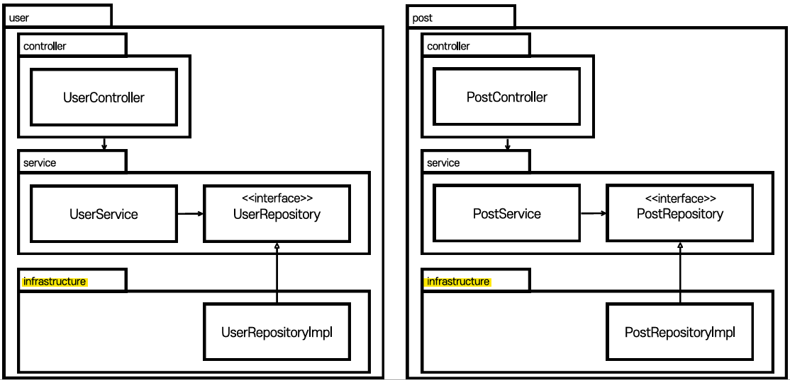
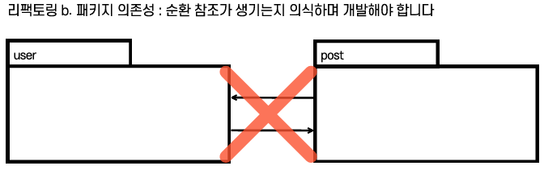
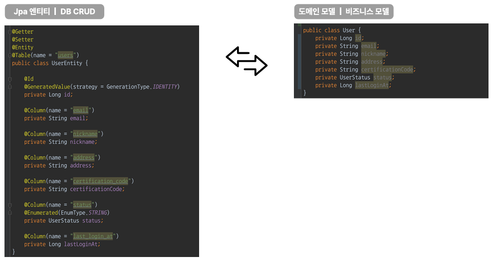
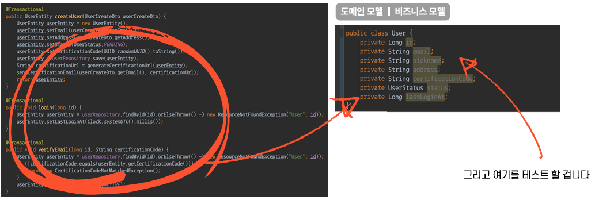

# 테스트의 범위
 - ServiceImpl과 Domain을 중점으로 공부할 예정임.
 - Controller와 RepositoryImpl은 아주 적게 다룰 것임.
   - 이유가 Controller는 요청을 받고 응답할 뿐이기 때문에 스프링에서 아주 잘 만들어 놨을 것이기 때문임.
   - Repository에서도 마찬가지로 이미 JPA에서 잘 만들어 놨기 때문에 다룰 이유가 없다고 생각 됨.

# 낮은 커버리지 걱정
 - **걱정** : JPA 와 Spring 쪽 테스트를 안 하게 되면 커버리지가 너무 낮게 나옴.
 - **도메인** : 도메인이 그만큼 빈약하다는 의미
 - **경쟁력** : 서비스의 경쟁력을 의심해봐야 함.

# 실기 전 추가 사항 및 추가 내용
 - JPA, Http 통신 등 외부 내용들은 의존성 역전 원리를 적용해 다룰 예정임.
   - ServiceImpl -> Repository <- RepositoryImpl
   - ServiceImpl -> Network <- NetworkImpl

 - 1부에선 필요할 경우 mock으로(Fake 구현체) 치환하여 테스트를 진행
 - 2부에선 Mockito나 H2 없이 테스트를 진행
   - 이전에 mock을 사용하거나 H2를 사용해서 중형 테스트로 진행했던 부분들을 소형 테스트로 변경할 수 있게 됨.
## 패키지 구조 리팩토링

 - 현재 layer로 분류
   - 장점
     - 구조가 단순하고 처음 사용하기 편함
   - 단점
     - 도메인이 눈에 보이지 않음
     - 동시 작업이 떨어짐
     - 사실상 경계, 의존성을 관리하지 않겠다는 것임
     

 - domain/layer로 분류
   - 장점
     - 어떤 도메인을 다루는 시스템인지 눈에 보임
     - 필요에 따라 MSA 시스템 확장이 가능
   - 단점
     - MVC에 익숙할 경우 컴포넌트 찾기가 어색할 수 있음

## 한 눈에 보는 변경 사항
### 1. 기존

### 2. 변경

 - repository -> **infrastructure** 로 네이밍 변경
   - 외부 연동을 구현하는 구현체가 repository 패키지에 들어가기 애매하기 때문!

### 3. 의존성 역전

### 4. 순환 참조에 주의!

 - 순환 참조는 피해야하는 해악임 주의할 것!

### 5. JPA 엔티티와 도메인 모델을 분리

### 6. setter를 없애고 domain/vo로 로직 이동

 - 서비스에 존재하는 로직을 도메인 엔티티 쪽으로 몰아넣을 것임
 - 도메인을 테스트할 것임
   - 테스트가 쉬워짐

### 7. CQRS (Command and Query Responsibility Segregation)
 - 명령과 질의를 철저히 분리시킴

**명령**
 - 상태를 바꾸는 메소드!
   - 명령 메소드는 void 타입이어야 함
   - 명령 메소드는 return this를 해선 안됨

**질의**
 - 상태를 물어보는 메소드
   - 질의 메소드는 상태를 변경해서는 안됨