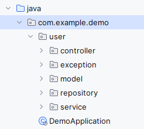
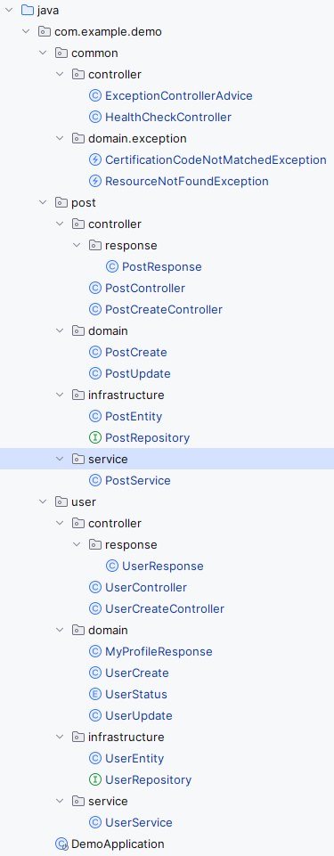
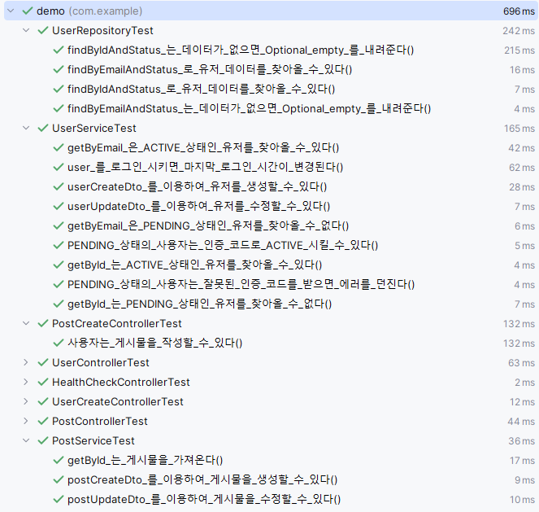
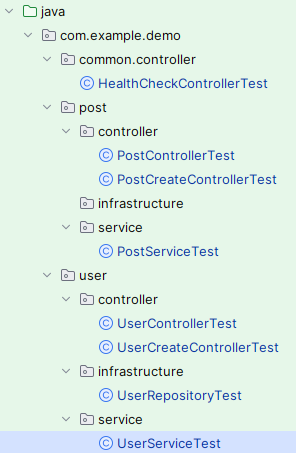
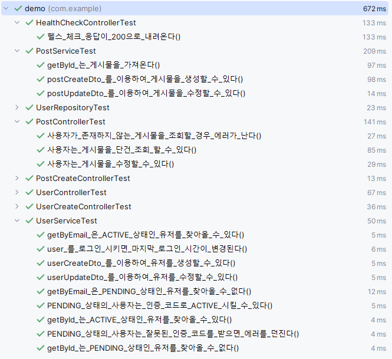

패키지 리팩토링!
1. 기존 프로젝트 코드들을 user 패키지를 생성하여 옮기기
 - 기존 구조

 - 변경된 구조

2. 추가 리팩토링 진행
 - model -> domain
 - dto 네이밍 -> 제거(이미 역할을 내포하고 있음.)
 - repository -> infrastructure

3. 리팩토링 후 테스트 재확인

 - 정상 동작하는 것을 확인!

4. 테스트의 구조 또한 위와 동일하게 변경

5. 리팩토링 후 테스트 재확인!

6. 끝!
 - 헥사고날과 같은 더 고도화된 아키텍처도 존재함.
   - 헥사고날은 도입에 너무 큰 리소스가 듦...
 - 강의 마지막 즈음엔 헥사고날과 같은 고도화된 아키텍처에 대해서도 학습 예정!