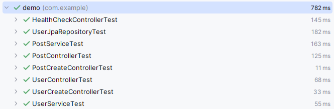
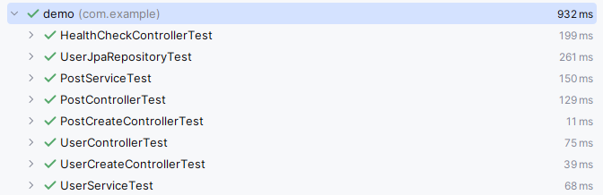
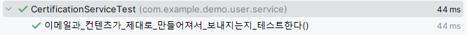

# 실습 2부 - 의존성 역전하기
- 외부 연동들에 의존성 역전 사용!
  - MailSender
  - Repository
- Repository 들의 네이밍 JpaRepository로 변경!

# 의존성 역전을 위해 인터페이스 만들기.
- UserRepository 인터페이스를 생성
- 구현체 UserRepositoryImpl 생성
  - 구현체는 UserJpaRepository를 주입받음.
  

UserRepository는 infrastructure에 있을 경우 상위 모듈인 service에서 하위인 infrastructure를 의존하는 그림이 나오게 됨.
따라서 서비스 하위에 외부 연동을 담당하는 port 패키지 생성 후 service에서 사용하는 인터페이스들은 port에 위치 시킴.

# 분리된 Repository에 따라 코드 수정
## post
```java
@Service
@RequiredArgsConstructor
public class PostService {

    private final PostRepository postRepository;
    private final UserService userService;

    public PostEntity getById(long id) {
        return postRepository.findById(id).orElseThrow(() -> new ResourceNotFoundException("Posts", id));
    }

    public PostEntity create(PostCreate postCreate) {
        UserEntity userEntity = userService.getById(postCreate.getWriterId());
        PostEntity postEntity = new PostEntity();
        postEntity.setWriter(userEntity);
        postEntity.setContent(postCreate.getContent());
        postEntity.setCreatedAt(Clock.systemUTC().millis());
        return postRepository.save(postEntity);
    }

    public PostEntity update(long id, PostUpdate postUpdate) {
        PostEntity postEntity = getById(id);
        postEntity.setContent(postUpdate.getContent());
        postEntity.setModifiedAt(Clock.systemUTC().millis());
        return postRepository.save(postEntity);
    }
}
```
```java
public interface PostRepository {
  Optional<PostEntity> findById(long id);

  PostEntity save(PostEntity postEntity);
}
```

```java
@Repository
@RequiredArgsConstructor
public class PostRepositoryImpl implements PostRepository {

	private final PostJpaRepository postJpaRepository;

	@Override
	public Optional<PostEntity> findById(long id) {
		return postJpaRepository.findById(id);
	}

	@Override
	public PostEntity save(PostEntity postEntity) {
		return postJpaRepository.save(postEntity);
	}
}
```

## user
```java
@Service
@RequiredArgsConstructor
public class UserService {

    private final UserRepository userRepository;

    private final JavaMailSender mailSender;

    public UserEntity getByEmail(String email) {
        return userRepository.findByEmailAndStatus(email, UserStatus.ACTIVE)
            .orElseThrow(() -> new ResourceNotFoundException("Users", email));
    }

    public UserEntity getById(long id) {
        return userRepository.findByIdAndStatus(id, UserStatus.ACTIVE)
            .orElseThrow(() -> new ResourceNotFoundException("Users", id));
    }

    @Transactional
    public UserEntity create(UserCreate userCreate) {
        UserEntity userEntity = new UserEntity();
        userEntity.setEmail(userCreate.getEmail());
        userEntity.setNickname(userCreate.getNickname());
        userEntity.setAddress(userCreate.getAddress());
        userEntity.setStatus(UserStatus.PENDING);
        userEntity.setCertificationCode(UUID.randomUUID().toString());
        userEntity = userRepository.save(userEntity);
        String certificationUrl = generateCertificationUrl(userEntity);
        sendCertificationEmail(userCreate.getEmail(), certificationUrl);
        return userEntity;
    }

    @Transactional
    public UserEntity update(long id, UserUpdate userUpdate) {
        UserEntity userEntity = getById(id);
        userEntity.setNickname(userUpdate.getNickname());
        userEntity.setAddress(userUpdate.getAddress());
        userEntity = userRepository.save(userEntity);
        return userEntity;
    }

    @Transactional
    public void login(long id) {
        UserEntity userEntity = userRepository.findById(id).orElseThrow(() -> new ResourceNotFoundException("Users", id));
        userEntity.setLastLoginAt(Clock.systemUTC().millis());
    }

    @Transactional
    public void verifyEmail(long id, String certificationCode) {
        UserEntity userEntity = userRepository.findById(id).orElseThrow(() -> new ResourceNotFoundException("Users", id));
        if (!certificationCode.equals(userEntity.getCertificationCode())) {
            throw new CertificationCodeNotMatchedException();
        }
        userEntity.setStatus(UserStatus.ACTIVE);
    }

    private void sendCertificationEmail(String email, String certificationUrl) {
        SimpleMailMessage message = new SimpleMailMessage();
        message.setTo(email);
        message.setSubject("Please certify your email address");
        message.setText("Please click the following link to certify your email address: " + certificationUrl);
        mailSender.send(message);
    }

    private String generateCertificationUrl(UserEntity userEntity) {
        return "http://localhost:8080/api/users/" + userEntity.getId() + "/verify?certificationCode=" + userEntity.getCertificationCode();
    }
}
```
```java
public interface UserRepository {
	Optional<UserEntity> findById(long id);

	Optional<UserEntity> findByIdAndStatus(long id, UserStatus userStatus);

	Optional<UserEntity> findByEmailAndStatus(String email, UserStatus userStatus);

	UserEntity save(UserEntity userEntity);
}
```
```java
@Repository
@RequiredArgsConstructor
public class UserRepositoryImpl implements UserRepository {

	private  final UserJpaRepository userJpaRepository;

	@Override
	public Optional<UserEntity> findById(long id) {
		return userJpaRepository.findById(id);
	}

	@Override
	public Optional<UserEntity> findByIdAndStatus(long id, UserStatus userStatus) {
		return userJpaRepository.findByIdAndStatus(id, userStatus);
	}

	@Override
	public Optional<UserEntity> findByEmailAndStatus(String email, UserStatus userStatus) {
		return userJpaRepository.findByEmailAndStatus(email, userStatus);
	}

	@Override
	public UserEntity save(UserEntity userEntity) {
		return userJpaRepository.save(userEntity);
	}
}
```


## 코드 수정 후 테스트를 돌려서 확인


# MailSender 별도 서비스로 분리
```java
@Service
@RequiredArgsConstructor
public class CertificationService {

	private final JavaMailSender mailSender;

	public void send(String email, String certificationUrl) {
		String title = "Please certify your email address";
		String content = "Please click the following link to certify your email address: " + certificationUrl;
		SimpleMailMessage message = new SimpleMailMessage();
		message.setTo(email);
		message.setSubject(title);
		message.setText(content);
		mailSender.send(message);
	}

	public String generateCertificationUrl(UserEntity userEntity) {
		return "http://localhost:8080/api/users/" + userEntity.getId() + "/verify?certificationCode=" + userEntity.getCertificationCode();
	}
}
```

## send 리팩토링
 - 분리 된 MailSender의 send 부분이 외부에서 주입받아 어색함.
 - CertificationService에서 직접 생성하도록 변경.
 - 호출하는 부분도 이에 맞도록 변경.
```java
public void send(String email, long userId, String certificationsCode) {
    String certificationUrl = generateCertificationUrl(userId, certificationsCode);
    String title = "Please certify your email address";
    String content = "Please click the following link to certify your email address: " + certificationUrl;
    SimpleMailMessage message = new SimpleMailMessage();
    message.setTo(email);
    message.setSubject(title);
    message.setText(content);
    mailSender.send(message);
}

public String generateCertificationUrl(long userId, String certificationCode) {
    return "http://localhost:8080/api/users/" + userId + "/verify?certificationCode=" + certificationCode;
}
```

# MailSender 의존성 역전 적용
```java
public interface MailSender {

	void send(String email, String title, String content);
}
```
```java
@Component
@RequiredArgsConstructor
public class MailSenderImpl implements MailSender {

	private final JavaMailSender javaMailSender;

	@Override
	public void send(String email, String title, String content) {
		SimpleMailMessage message = new SimpleMailMessage();
		message.setTo(email);
		message.setSubject(title);
		message.setText(content);
		javaMailSender.send(message);
	}
}
```
```java
@Service
@RequiredArgsConstructor
public class CertificationService {

	private final MailSender mailSender;

	public void send(String email, long userId, String certificationsCode) {
		String certificationUrl = generateCertificationUrl(userId, certificationsCode);
		String title = "Please certify your email address";
		String content = "Please click the following link to certify your email address: " + certificationUrl;
		mailSender.send(email, title, content);
	}

	public String generateCertificationUrl(long userId, String certificationCode) {
		return "http://localhost:8080/api/users/" + userId + "/verify?certificationCode=" + certificationCode;
	}
}
```

## 의존성 역전 후 테스트


# 새로 생긴 CertificationService에 대한 테스트 작성
 - SpringBoot 어노테이션 없이 테스트 작성!
 - 이메일과 컨텐츠가 제대로 생성되어 동작하는지 확인하고자함.

## MailSender를 필요로 하기 때문에 Fake를 만들어서 테스트에 사용
```java
public class FakeMailSender implements MailSender {

	public String email;
	public String title;
	public String content;

	@Override
	public void send(String email, String title, String content) {
		this.email = email;
		this.title = title;
		this.content = content;
	}
}
```

```java
public class FakeMailSender implements MailSender {

	public String email;
	public String title;
	public String content;

	@Override
	public void send(String email, String title, String content) {
		this.email = email;
		this.title = title;
		this.content = content;
	}
}
```

## 테스트 결과
