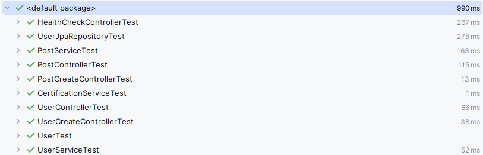

# 목표
### 1. 도메인과 영속성 객체 구분
### 2. 우리 시스템이 외부 시스템과 독립적이게 구성

 - 현재 Entity 객체들을 손볼 필요가 있음.
   - UserEntity에 대응되는 User 클래스 생성.

# Entity와 같은 필드를 가진 도메인 클래스 생성.
```java
public class Post {
	private Long id;
	private String content;
	private Long createdAt;
	private Long modifiedAt;
	private UserEntity writer;

	@Builder
	public Post(Long id, String content, Long createdAt, Long modifiedAt, UserEntity writer) {
		this.id = id;
		this.content = content;
		this.createdAt = createdAt;
		this.modifiedAt = modifiedAt;
		this.writer = writer;
	}
}
```
```java
public class User {
   private Long id;
   private String email;
   private String nickname;
   private String address;
   private String certificationCode;
   private UserStatus status;
   private Long lastLoginAt;

   @Builder
   public User(Long id, String email, String nickname, String address, String certificationCode, UserStatus status,
           Long lastLoginAt) {
      this.id = id;
      this.email = email;
      this.nickname = nickname;
      this.address = address;
      this.certificationCode = certificationCode;
      this.status = status;
      this.lastLoginAt = lastLoginAt;
   }
}
```

# 새롭게 바꾼 도메인 클래스에 맞도록 코드 수정
 - Service와 구현체 등에서 모두 변경된 클래스로 변경. 

## UserEntity -> User 로 바꾸는 로직 구현.
```java
public User toModel(){
  return User.builder()
      .id(id)
      .email(email)
      .nickname(nickname)
      .address(address)
      .certificationCode(certificationCode)
      .status(status)
      .lastLoginAt(lastLoginAt)
      .build();
}
```

> 도메인 -> 영속성 객체 변환 <br/>
> 도메인은 인프라 레이어의 정보를 모르는 것이 좋음. <br/>
> 따라서 영속성 객체에서 모델을 받아서 변환하는 코드를 넣기로 함. <br/>
```java

```

## UserCreate를 받아 User로 변환하는 로직 또한 User 도메인으로 refactor
```java
public static User from(UserCreate userCreate){
  return User.builder()
      .email(userCreate.getEmail())
      .nickname(userCreate.getNickname())
      .address(userCreate.getAddress())
      .status(UserStatus.PENDING)
      .certificationCode(UUID.randomUUID().toString())
  .build();
}
```
 - 도메인에 책임이 생기면서 테스트 코드가 필요해짐.

## 서비스에 있는 로직들도 도메인으로 refactor
```java
@Transactional
public UserEntity update(long id, UserUpdate userUpdate) {
   UserEntity userEntity = getById(id);
   userEntity.setNickname(userUpdate.getNickname());
   userEntity.setAddress(userUpdate.getAddress());
   userEntity = userRepository.save(userEntity);
   return userEntity;
}
```
서비스에 있던 update와 같은 로직을 도메인으로 refactor!

```java
public User update(UserUpdate userUpdate) {
   return User.builder()
   .id(id)
   .email(email)
   .nickname(userUpdate.getNickname())
   .address(userUpdate.getAddress())
   .certificationCode(certificationCode)
   .status(status)
   .lastLoginAt(lastLoginAt)
   .build();
}
```

## 직접 저장을 잘 시켜줘야함
 - JPA와의 의존성이 끊어짐
   - 영속성 객체가 아니게 되었음. 
   - JPA가 알아서 감지해서 수정해주던 기능을 사용할 수 없음.

## 컨트롤러들에 있는 Http 응답 매핑을 응답 객체에게 위임시켜줌
```java
public PostResponse toResponse(PostEntity postEntity) {
   PostResponse PostResponse = new PostResponse();
   PostResponse.setId(postEntity.getId());
   PostResponse.setContent(postEntity.getContent());
   PostResponse.setCreatedAt(postEntity.getCreatedAt());
   PostResponse.setModifiedAt(postEntity.getModifiedAt());
   PostResponse.setWriter(userController.toResponse(postEntity.getWriter()));
   return PostResponse;
}
```
- 이를 통해서 UserCreateController에 존재하던 UserController 의존성이 없어짐!
```java
@Tag(name = "유저(users)")
@RestController
@RequestMapping("/api/users")
@RequiredArgsConstructor
public class UserCreateController {

    private final UserController userController;
    private final UserService userService;

    @PostMapping
    public ResponseEntity<UserResponse> createUser(@RequestBody UserCreate userCreate) {
        User user = userService.create(userCreate);
        return ResponseEntity
            .status(HttpStatus.CREATED)
            .body(UserResponse.from(user));
    }

}
```

# 도메인과 영속성 객체 구분 후 테스트 결과
