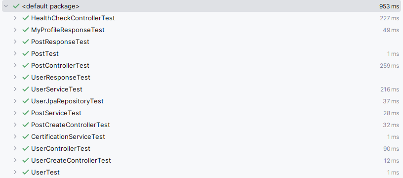

# mock, h2, SpringBoot 없이 테스트 작성하기.

## 대망의 UUID가 등장!
```java
@Test
public void User는_UserCreate_객체로_생성할_수_있다(){
    // given
    UserCreate userCreate = UserCreate.builder()
            .email("kok202@naver.com")
            .nickname("kok202")
            .address("Pangyo").build();

    // when
    User user = User.from(userCreate);

    // then
    assertThat(user.getId()).isEqualTo(0L);
    assertThat(user.getEmail()).isEqualTo("kok202@naver.com");
    assertThat(user.getAddress()).isEqualTo("Pangyo");
    assertThat(user.getStatus()).isEqualTo(UserStatus.PENDING);
    assertThat(user.getCertificationCode()).isEqualTo(??);
}
```

# 의존성 역전
 - common 하위 의존성 역전을 위한 인터페이스와 구현체 생성

## ClockHolder, UuidHolder를 생성
```java
public interface ClockHolder {

    long millis();
}
```
```java
public interface UuidHolder {

    String random();
}
```
## SystemClockHolder, SystemUuidHolder 구현
```java
@Component
public class SystemClockHolder implements ClockHolder {
    @Override
    public long millis() {
        return Clock.systemUTC().millis();
    }
}
```
```java
@Component
public class SystemUuidHolder implements UuidHolder {
    @Override
    public String random() {
        return UUID.randomUUID().toString();
    }
}
```

### 의존역전한 인터페이스와  구현체를 사용하도록 도메인과 서비스를 수정해주세요 :) 

## 테스트 시 사용하기 위한 fake 구현체 작성
```java
@RequiredArgsConstructor
public class TestClockHolder implements ClockHolder {

    private final long millis;

    @Override
    public long millis() {
        return millis;
    }
}
```
```java
@RequiredArgsConstructor
public class TestUuidHolder implements UuidHolder {

    private final String uuid;

    @Override
    public String random() {
        return uuid;
    }
}
```

## 로그인 시간 처리
- 위 과정과 동일하게 ClockHolder를 사용하고, TestClockHolder를 사용해서 테스트 진행하면 됩니다.


# 테스트 결과
