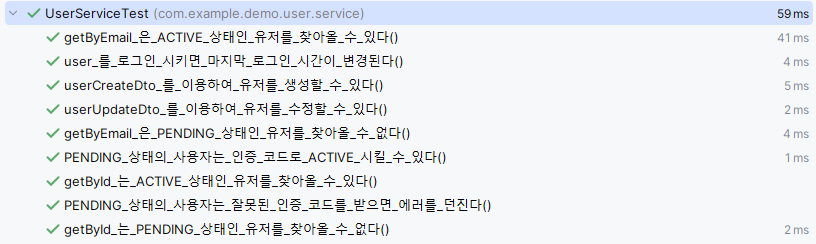
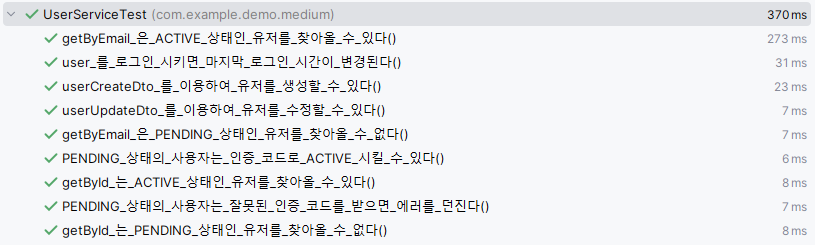
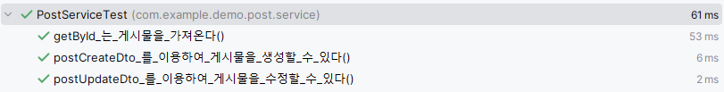
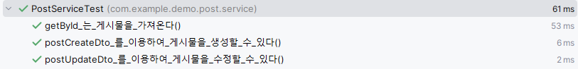
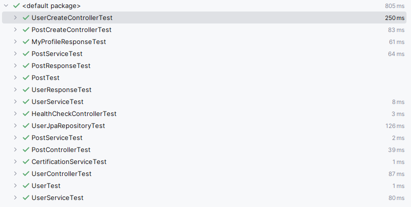

# service에 테스트코드 넣기

## FakeRepository 구현
```java
public class FakeUserRepository implements UserRepository {
    private final AtomicLong autoGeneratedId = new AtomicLong(0);

    private final List<User> data = new ArrayList<>();

    @Override
    public Optional<User> findById(long id) {
        return data.stream().filter(item -> item.getId().equals(id)).findAny();
    }

    @Override
    public Optional<User> findByIdAndStatus(long id, UserStatus userStatus) {
        return data.stream().filter(item -> item.getId().equals(id) && item.getStatus() == userStatus).findAny();
    }

    @Override
    public Optional<User> findByEmailAndStatus(String email, UserStatus userStatus) {
        return data.stream().filter(item -> item.getEmail().equals(email) && item.getStatus() == userStatus).findAny();
    }

    @Override
    public User save(User user) {
        if(user.getId() == 0 || user.getId() == null){
            User newUser = User.builder()
                    .id(autoGeneratedId.incrementAndGet())
                    .email(user.getEmail())
                    .nickname(user.getNickname())
                    .address(user.getAddress())
                    .certificationCode(user.getCertificationCode())
                    .status(user.getStatus())
                    .lastLoginAt(user.getLastLoginAt())
                    .build();
            data.add(newUser);
            return newUser;
        } else{
//            jpa 동작 기능인, 이미 존재할 경우 해당 데이터 지우고 삽입
            data.removeIf(i -> Objects.equals(i.getId(), user.getId()));
            data.add(user);
            return user;
        }
    }
}
```
```java
public class FakePostRepository implements PostRepository {

    private final AtomicLong autoGeneratedId = new AtomicLong(0);

    private final List<Post> data = new ArrayList<>();

    @Override
    public Optional<Post> findById(long id) {
        return data.stream().filter(item -> item.getId().equals(id)).findAny();
    }

    @Override
    public Post save(Post post) {
        if(post.getId() == 0 || post.getId() == null){
            Post newPost = Post.builder()
                    .id(autoGeneratedId.incrementAndGet())
                    .content(post.getContent())
                    .createdAt(post.getCreatedAt())
                    .modifiedAt(post.getModifiedAt())
                    .writer(post.getWriter())
                    .build();
            data.add(newPost);
            return newPost;
        } else{
//            jpa 동작 기능인, 이미 존재할 경우 해당 데이터 지우고 삽입
            data.removeIf(i -> Objects.equals(i.getId(), post.getId()));
            data.add(post);
            return post;
        }
    }
}
```

## ServiceTest 코드에서 SrpingBoot 어노테이션들을 전부 버림.
- 테스트 전 userService를 미리 만들어서 이걸 사용함!
- 이제 Test 내에 불필요한 Stub 코드 제거 가능!
```java
@BeforeEach
void init(){
        FakeMailSender fakeMailSender = new FakeMailSender();
        FakeUserRepository fakeUserRepository = new FakeUserRepository();
        this.userService = UserService.builder()
        .uuidHolder(new TestUuidHolder("aaaaaaaa-aaaa-aaaa-aaaa-aaaaaaaaaaab"))
        .clockHolder(new TestClockHolder(1678530673958L))
        .userRepository(fakeUserRepository)
        .certificationService(new CertificationService(fakeMailSender))
        .build();
//		데이터 추가
        fakeUserRepository.save(User.builder()
        .id(1L)
        .email("kok202@naver.com")
        .nickname("kok202")
        .address("Seoul")
        .certificationCode("aaaaaaaa-aaaa-aaaa-aaaa-aaaaaaaaaaaa")
        .status(UserStatus.ACTIVE)
        .lastLoginAt(0L)
        .build());
        fakeUserRepository.save(User.builder()
        .id(2L)
        .email("kok303@naver.com")
        .nickname("kok303")
        .address("Seoul")
        .certificationCode("aaaaaaaa-aaaa-aaaa-aaaa-aaaaaaaaaaab")
        .status(UserStatus.PENDING)
        .lastLoginAt(0L)
        .build());
        }
```



- 소형 테스트로 전환됐기 때문에 속도가 아주 빠름!
- 밑에는 기존 테스트 비교!


## Post도 동일하게 처리
```java
@BeforeEach
void init(){
    FakeUserRepository fakeUserRepository = new FakeUserRepository();
    FakePostRepository fakePostRepository = new FakePostRepository();
    this.postService = PostService.builder()
            .postRepository(fakePostRepository)
            .userRepository(fakeUserRepository)
            .build();
//		데이터 추가
    User user1 = User.builder()
            .id(1L)
            .email("kok202@naver.com")
            .nickname("kok202")
            .address("Seoul")
            .certificationCode("aaaaaaaa-aaaa-aaaa-aaaa-aaaaaaaaaaaa")
            .status(UserStatus.ACTIVE)
            .lastLoginAt(0L)
            .build();
    User user2 = User.builder()
            .id(2L)
            .email("kok303@naver.com")
            .nickname("kok303")
            .address("Seoul")
            .certificationCode("aaaaaaaa-aaaa-aaaa-aaaa-aaaaaaaaaaab")
            .status(UserStatus.PENDING)
            .lastLoginAt(0L)
            .build();
    fakeUserRepository.save(user1);
    fakeUserRepository.save(user2);
    fakePostRepository.save(Post.builder()
            .id(1L)
            .content("helloworld")
            .createdAt(1678530673958L)
            .modifiedAt(0L)
            .writer(user1)
            .build());
}
```



### 이제 시간을 비교할 수 있게 되었음.
```java
assertThat(post.getModifiedAt()).isEqualTo(1679530673958L);
```
### 테스트!

