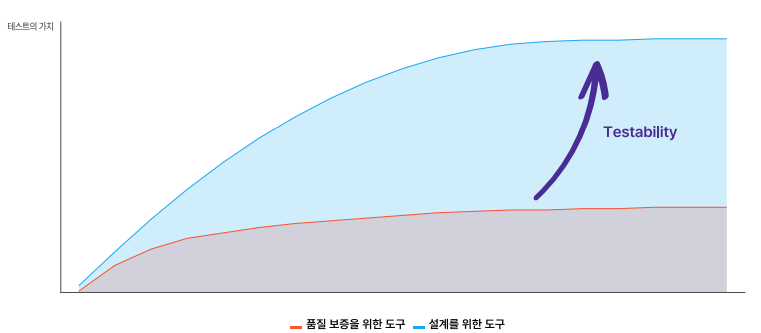
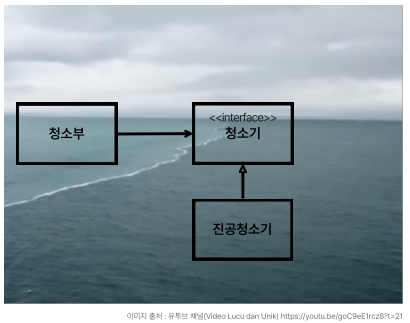
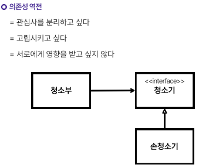
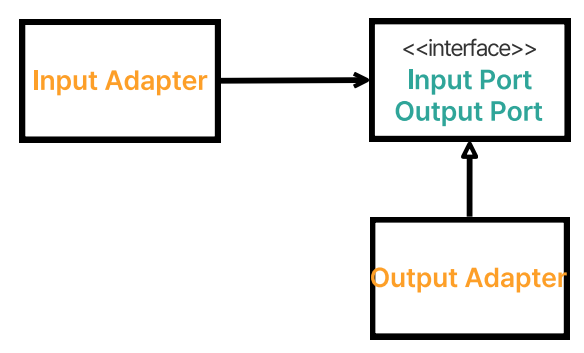
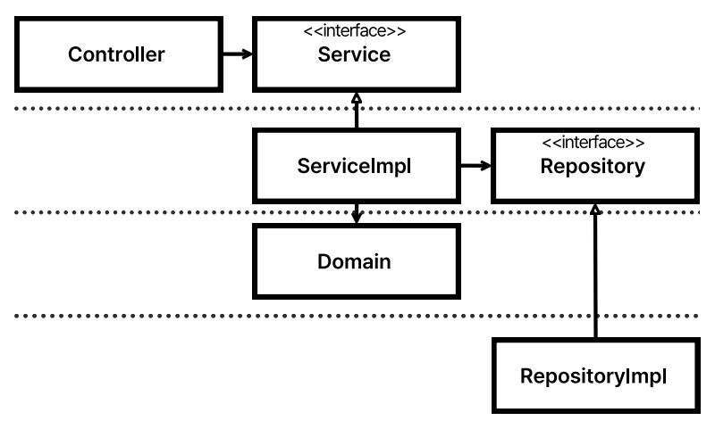
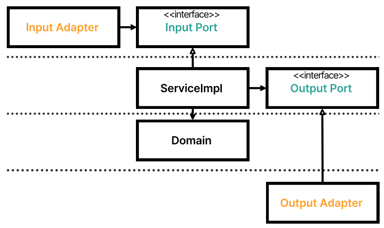
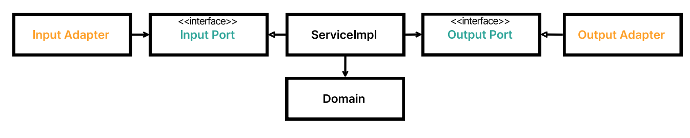
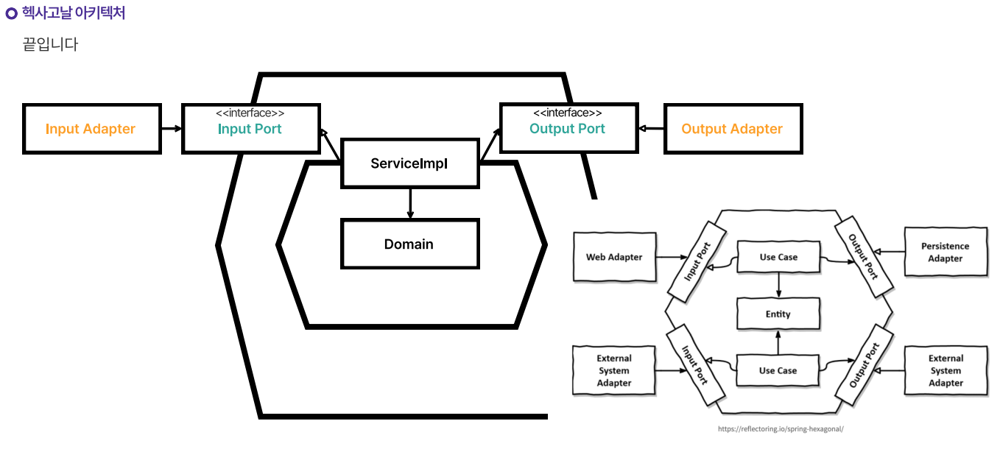

# 아키텍처
## 갑자기 아키텍처?

- 테스트는 품질을 위한 도구이면서, 설계를 위한 도구임.
- Testability를 높여야 설계를 위한 도구로 사용 가능.
- 테스트와 설계는 상호보완적.
  - 테스트가 어렵다면 아키텍처가 정답을 알려줌.

### 개발하기 어렵다면, 테스트하기 쉽도록 개발하면 편하다.

## 아키텍트의 정의
- 아키텍처란 어떤 비즈니스 문제를 해결하기 위해 준수해야하는 제약을 넣는 과정!
  - 아키텍처를 지키려고 하다보면 오히려 더 불편해짐.
  - 이로 인해 꼭 필요한 것이 아니라면 차라리 없는 것이 나을 수 있음.
- 그럼에도 아키텍처를 사용하는 이유?
  - 아키텍처를 사용하기 전 문제 상황을 정확하기 인지하는 것이 중요함.
  - 꼭 써야하는 이유를 파악하고, 구성원들이 모두 동의해야함.
- 아키텍처는 종착지가 아닌 여정에 가깝고, 고정된 산출물이 아니라 계속된 탐구 과정에 더 가까움을 이해해야 좋은 아키텍처가 만들어진다.

## 아키텍트의 목표
- 인력 절감
  - 동시 작업이 가능해야함
  - 관심사를 분리해야함
  - 경계를 나눠야함
    - 의존성 역전 등을 이용
- 정책을 만들고 세부사항을 미루는 시스템 개발
  - 개발 초기에 상세한 시스템 기술을 정할 필요가 없다.
    - DB, 웹 서버, REST, 프레임워크 등
    - MySQL, Apache 등을 미리 선택할 필요가 없음.

### 경계
- 의존성 역전은 경계를 만드는 방법 중 하나.

# 헥사고날

## 의존성 역전과 경계

- 의존성 역전 = 포트 - 어댑터 패턴

## 개선된 아키텍처를 진화시키기
- 기존 계층 구조

- 기존 계층 구조에서의 input, output port

- 계층 제거

- 완성된 헥사고날 아키텍처

  - 이때까지 진행한 실습과 학습 내용이 전부 헥사고날과 클린 아키텍처를 향하고 있었음.
  - 계층이 제거되면 헥사고날 아키텍처와 같은 모습이 됨