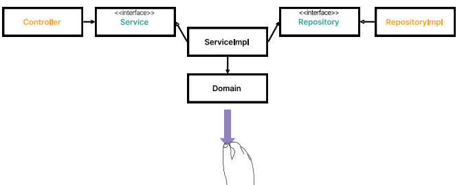
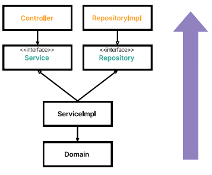
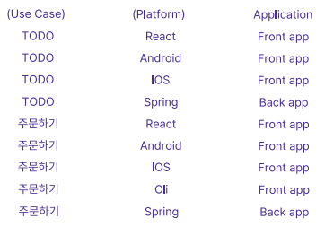

# 레이어드 vs 헥사고날
## 레이어드 아키텍처의 문제점
- DB 위주의 사고를 하게 됨
- 상향식
  - Jpa를 먼저 생각하게 됨
- 하향식
  - 프레임워크를 먼저 생각하게 됨

## 헥사고날

- 헥사고날은 상향식일 때 자연스러움!
- 도메인에 집중하고, controller와 repository 구현체는 얹혀질 뿐임.
- 구현체가 Jpa인지, MyBatis인지 중요하지 않음.
  - 중요한 것은 도메인!

## 험블 객체 패턴
- 험블(Humble)
  - '별 볼 일 없는'
  - 테스트하기 어려운 부분을 의미
- 라이브러리 변경이 계산 로직 변경에 영향을 주어선 안됨
- 본질과 험블을 구분할 수 있어야함
- 도메인 설계능력이 중요함

# 어댑터와 유스케이스
## input 어댑터 -> 컨트롤러
- ~~HTTP 요청을 자바 객체로 매핑~~
  - 스프링
- ~~권한 검사~~
  - 스프링 시큐리티
- ~~입력 유효성 검증~~
  - @Valid
- 입력을 유스케이스의 입력 모델로 매핑
- 유스케이스 호출
- 유스케이스의 출력을 HTTP로 매핑
- ~~HTTP 응답을 반환~~
  - 스프링

## output 어댑터 -> Jpa 어댑터
- 입력을 받는다
- 입력을 DB 포맷으로 매핑한다.
- 입력을 DB로 보낸다
- DB 출력을 애플리케이션 포맷으로 매핑한다.
- 출력을 반환한다

## 유스케이스의 중요성
- 개발자가 인식하는 애플리케이션

- 플랫폼이나 애플리케이션 없이 Use Case만 있어도 어떤 시스템인지 인식이 됨
- Use case가 없을 땐 어떤 시스템인지 인식되지 않음
- 플랫폼을 쫓기보다, 유스케이스에 집중

# 모델

## 모델은 어디까지 세분화해야하는가?
- Domain Entity와 Jpa Entity를 분리해야하는가?
  - 구분하지 말자 : 그럴거면 왜 ORM을 사용하는가?
  - 구분하자 : DB에 너무 강결합됨
- 단일 모델
  - 사실상 현업에서 불가능함
  - 사용자에게 표시되어서는 안되는 데이터가 공개될 수 있음
- HTTP 응답을 위한 모델이 필요함
- DB에 종속되지 않기 위해 Jpa Entity가 필요함
- 위와 같은 이유로 각 계층에서의 필요로 인해 7개 이상의 모델이 나올 수 있음.

모델의 세분화는 원칙과 편의성을 고려해서 팀 내에서 목표에 맞게 사용해야함.
다만, **도메인 모델**만큼은 순수한 것이 좋다고 생각함
