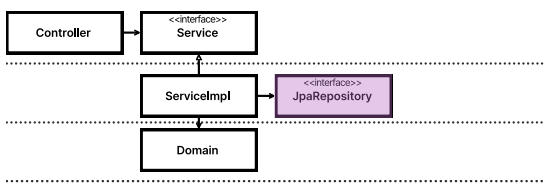
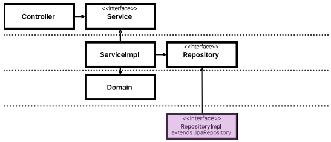
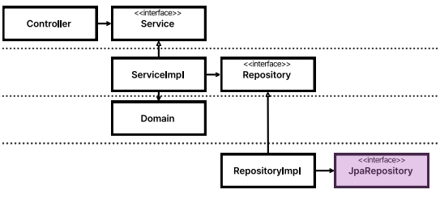
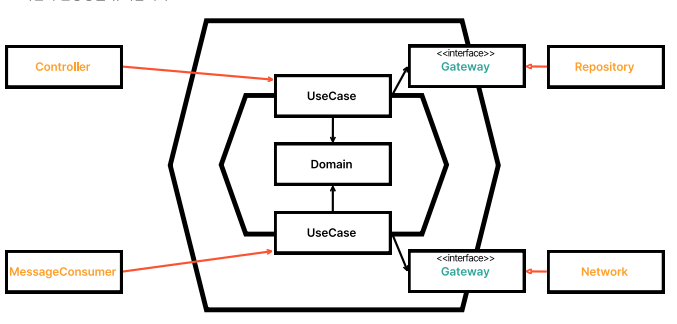
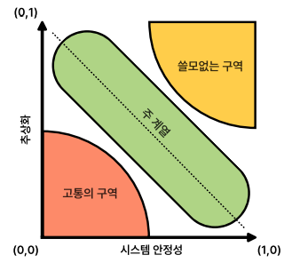

# JPA 분리
## Repository를 다루는 방식과 장단점

- JpaRepository as Repository
  - Repository 인터페이스에 직접 사용
  - JpaRepository가 이미 인터페이스이기때문에 Fake 구현해서 테스트 가능
    - Fake가 불필요한 인터페이스를 구현해야함
    - Service가 불필요한 모든 메소드를 알게됨
    - Domain Entity가 Persistence Entity에 종속됨
    - Service가 Jpa에 의존적임

- JpaRepository as RepositoryImpl
    - Repository 인터페이스의 구현체로 사용
      - Service가 JpaRepository의 모든 기능을 알고있을 필요가 없음
      - 하지만 여전히 Service가 Jpa에 의존적임

- JpaRepository as RepositoryImpl's member
    - Repository의 멤버 변수로 사용

# 서비스
## 서비스는 추상화되어야 하는가?
- 서비스의 추상화가 필요한가?
- 서비스 = 유스케이스여야한다고 생각함
- 컨트롤러는 테스트가 크게 필요하지 않음
- 사실상 유스케이스 호출이 정확하게 일어나는지 확인만 하면 됨
- 서비스를 추상화하지 않아도 여전히 단방향을 유지할 수 있음
  - 
- 유스케이스 분리로 인한 장점을 체감하지 못한다면 서비스 레이어를 굳이 추상화할 필요 없어보임

## 트레이드 오프

- 고통의 구역
  - 컴포넌트와 시스템이 불안정하고 추상화도 되어 있지 않음
- 쓸모없는 구역
  - 컴포넌트, 시스템이 안정한데 추상화를 쓸데없이 한 경우
- 주 계열
  - 적당한 지점
- 결국 추상화는 상황에 따라서 바뀌게 됨
- 외우기보다 원리를 이해하고 상황에 맞는 해결 방법을 사용할 것

# 기타
## 기술
- 기술은 알고 나면 당연한 것 투성이임

## DD와 클린 아키텍처
- 비즈니스를 집중하는 방법 : DDD
- 비즈니스를 잘 짜는 법 : 테스트
- 비즈니스와 기술을 분리하는 법 : 클린 아키텍처
- 비즈니스와 기술을 분리하는 구체적인 방법(클린 아키텍처의 구현법) : 헥사고날