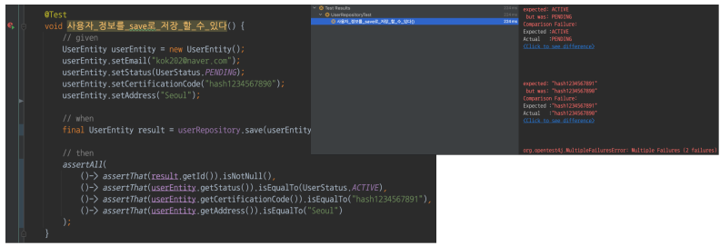

# 범위
## 테스트 어디까지 해야하는가?
- 종종 테스트는 극한 상황까지 처리할 것을 얘기하기도 함
- 인수테스트까지 테스트의 구현 범위로 넣는 경우도 있음
- 하지만, 그 정도까지 필요하지 않다고 생각함 

### '배포 시점 개발자가 확신을 가질 수 있을 정도'면 충분하다고 생각함
- 커버리지가 중요하지 않다고 생각함
- 테스트가 정상이니 이번 배포가 안전하다
- 테스트 덕분에 설계가 좋아졌다
  - 절반 이상이 성공이라고 생각함

## 테스트는 무엇을 해야하는가?
### Right-BICEP
- Right
  - 결과가 올바른가?
- Boundary conditions
  - 경계 조건이 맞는가?
  - edge case : 입력의 양 끝단 같은 조금 특별한 값
  - coner case : edge 케이스보다 포괄적임.
  - 엣지 케이스는 시스템 내부의 특별 케이스
  - 코너 케이스는 시스템 외부의 상황까지 포함
- Inversion relationship(굳이?)
  - 역 관계를 검사할 수 있는가?
  - 역 관계를 검증할 수 있다면 검증하라.
- Cross check(굳이?)
  - 교차 검증할 수 있는가?
- Error conditions(굳이?)
  - 오류 상황을 강제로 일어나게 할 수 있는가?
- Performance characteristics
  - 성능 조건이 기준에 부합하는가?

# 테스트 팁
## ParameterizedTest

- 동일한 로직을 여러번 테스트할 경우 사용
- 반복적인 테스트를 논리 로직 없이 돌릴 수 있다
- MethodSource, CsvSource, ValueSource 등을 이용해 전달 인자 나열 가능

## assertAll

- assert 문이 여러개일 경우 assertAll 내부의 모든 assert 문이 통과하는지 확인

## 하나의 테스트
- 한 테스트는 한 테스트만 진행

## assert는 하나만 해야한다?
- 한 테스트에 assert 하나만 사용하는 경우도 있음
- 원칙보다 중요한 것은 **표현력**이 핵심임

## Thread sleep
- 개발자의 테스크탑 성능에 따라 테스트 결과가 달라짐
- 테스트가 비결정적이게 됨
- Awaitility 등을 사용해보기

## FIRST 원칙
- Fast
  - 빨라야한다
- Independent
  - 독립적이어야한다
- Repeatable
  - 반복해도 결과는 동일해야한다
- Self-validating
  - 테스트 수행 후 시스템의 성공/실패를 알 수 있어야 한다
- Timely
  - 적시에(코드 구현 전) 작성되어야 한다

# 문화
## 트로이 목마
- 테스트를 전파하는 트로이 목마
  - '우리는 테스트 코드가 없나요?'
  - 처음엔 해당 질문에 테스트가 없는 이유를 설명함
  - 죄책감이 느껴져서 테스트를 공부해서 구현하게 되었음
- 우리가 트로이 목마가 되자
  - 테스트의 필요성과 어떤 식으로 하는지 어필하면 될 것임

## 테스트에서 마틴 파울러는 신이야.
### 완전한 리팩토링
- 리팩토링 전 제대로 된 테스트부터 마련
- 테스트는 반드시 자가진단하도록
- 리팩토링하다 코드가 깨져서 고생했다는 것은 리팩토링한 것이 아니다

### 테스트
- 자주 테스트하라
- 적어도 하루 한 번은 전체 테스트를 돌려보자

### 좋은 코드
- 좋은 코드를 가늠하는 방법은 "얼마나 수정하기 쉬운가?"다

## 컴퓨터가 이해할 수 있는 코드는 누구나 작성할 수 있다.
## 좋은 프로그래머는 사람이 이해할 수 있는 코드를 작성한다.
- 의도가 보이는 설계여야 함
- 의도가 보이는 테스트가 최고임
- 테스트 = 문서